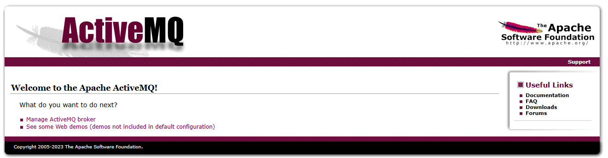

import Meta from './_include/activemq.md';

<Meta name="meta" />

## 入门指南

## 登录验证

1. Websoft9 控制台安装 AITable 后，通过 "我的应用" 查看应用详情，在 "访问" 标签页中获取登录信息。

2. 本地浏览器访问登录 URL，输入账号验证成功后进入 ActiveMQ Welcome 页面
   

3. 访问链接 **Manage ActiveMQ broker** 进入 ActiveMQ Mangement 页面
   

## 用户指南

阅读官方文档 [Using Apache ActiveMQ](https://activemq.apache.org/using-activemq) 并结合下面的指南快速掌握它的使用。

## 配置选项

- [配置 ActiveMQ](http://activemq.apache.org/configuration.html)
- [Web Samples](https://activemq.apache.org/components/classic/documentation/web-samples)

## 管理维护

- 修改 ActiveMQ 控制台密码：通过 **Websoft9 控制台 > 我的应用 > 应用管理 > 编排** 修改

## 故障