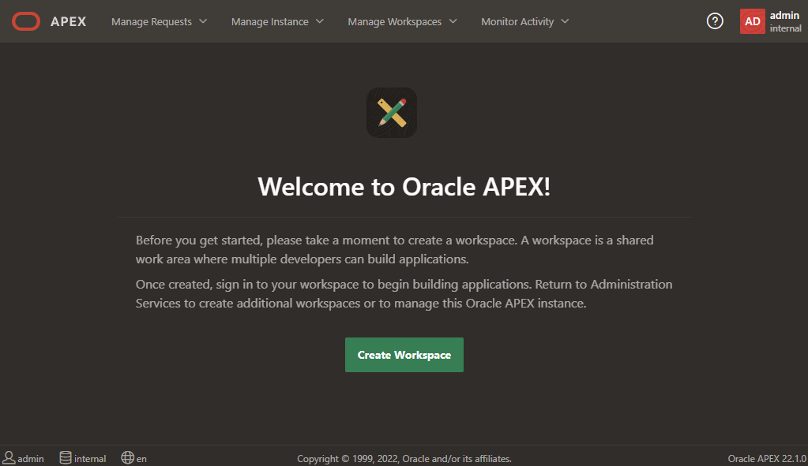
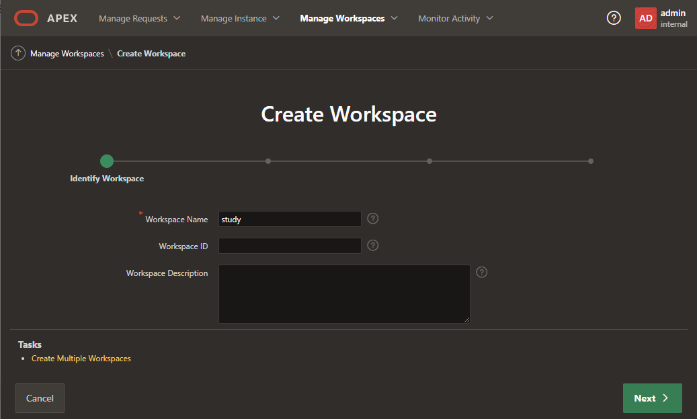

import Meta from './_include/apex.md';

<Meta name="meta" />

## 入门指南{#guide}

### 登录后台{#login}

1. Websoft9 控制台安装 APEX 后，通过 "我的应用" 查看应用详情，在 "访问" 标签页中获取登录信息。  

2. 耐心等待 10 分钟，直至 APEX 初始化完成，方可进入登录页面
   

3. 登录成功后，系统提示修改密码后，进入后台
      

### 创建工作区{#workspace}

虽然 APEX 默认有一个名为 internal 的工作区，但它仅用于管理。如需创建应用，必须再创建一个新的工作区：

1. 登录后台，点击创建新的 WorkSpace
   

2. 根据向导：新建 schema，并设置新的工作区的用户名、密码及邮件地址，直至完成 WorkSpace 的新建
   

### 创建应用

创建完工作区后，需**使用新的工作区登录**，然后再[创建应用](https://docs.oracle.com/en/database/oracle/apex/23.2/htmdb/choosing-an-application-creation-method.html)。 

## 配置选项{#configs}

- 多语言（✅）：登录控制台可以修改语言（包含中文）
- [API](https://apex.oracle.com/api)
- 应用备份： 可以在 APEX 控制台方便的对 **APP Builder** 进行应用的导入与导出，实现备份

## 管理维护{#administrator}

## 故障
