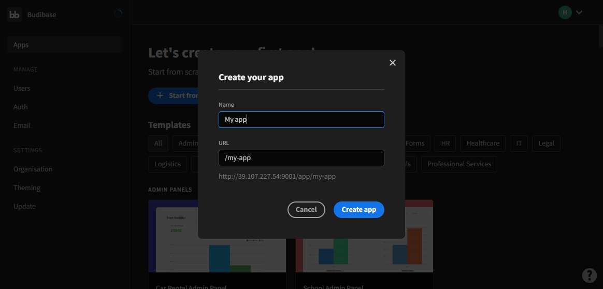

import Meta from './_include/budibase.md';

<Meta name="meta" />

## 入门指南{#guide}

### 登录后台{#wizard}

1. Websoft9 控制台安装 Budibase 后，通过 "我的应用" 查看应用详情，在 "访问" 标签页中获取访问信息。  

2. 首次使用，需注册管理员用户
   
   

3. 选择基于现有模板创建或全新方式，开始创建应用

   

### 核心组件

- Data： 管理数据源，支持 Budibase 内部建表进行数据建模，也支持连接外部数据源
- Design： 页面设计，Budibase 提供丰富的控件来构建页面，数据控件用来做数据绑定和呈现
- Automate： 用来设计流程的自动化执行，触发条件支持数据变化、Webhook、App Action 及 Cron

## 配置选项{#configs}

- [API Reference](https://docs.budibase.com/docs/public-api)
- 多语言（✅）

## 管理维护{#administrator}

## 故障