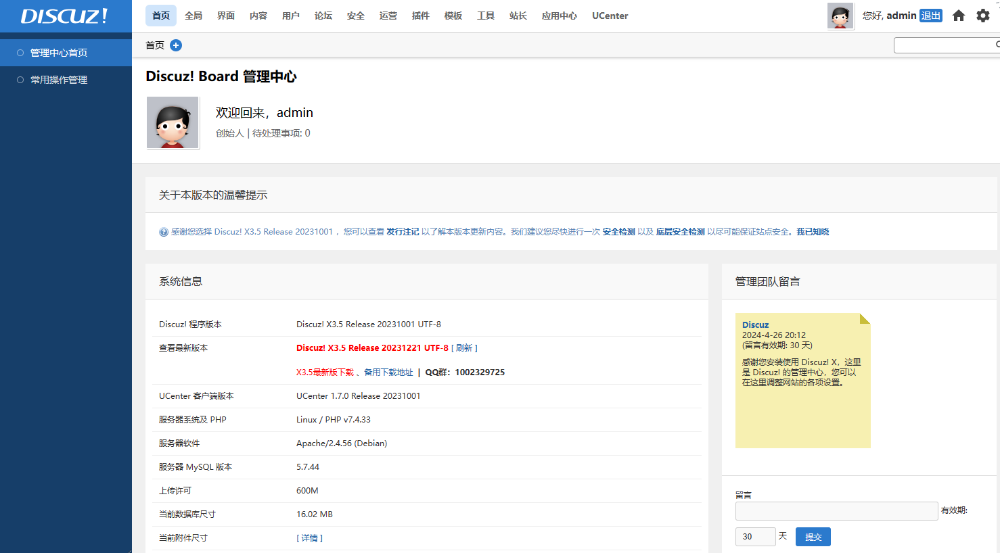

import Meta from './_include/discuz.md';

<Meta name="meta" />

## 入门指南{#guide}

### 初始化{#wizard}

Websoft9 控制台安装 Discuz 后，通过 "我的应用" 查看应用详情，在 "访问" 标签页中获取登录信息。  

1. 使用本地电脑浏览器访问，就进入引导首页，其中检查安装环境和设置运行环境采用默认设置

3. 第③步"创建数据库"时，数据库连接使用默认值，仅需设置自己的管理员账号信息 

4. 点击"安装"后，系统开始初始化  

5. 初始化成功后登录后台
    

### 模板/主题/应用中心

Discuz 有非常强大生态，官方[应用中心](https://addon.dismall.com/) 提供大量的模板和插件等资源。  

登录到 Discuz 后台，通过 "模板" 菜单 > "获取更多模板" 连接应用中心，下载所需的模板。  


## 配置选项{#configs}

- Discuz 配置文件（已挂载） */var/www/html/config/config_default.php*  
- PHP 配置文件（已挂载） */usr/local/etc/php/conf.d/php_exra.ini*  
- 多语言（×）
- 移动端：官方没有提供移动端
- 上传附件限制：**用户组**编辑页面中的 "论坛相关" > "附件相关" 菜单进行设置

## 管理维护{#administrator}

### 设置伪静态

1. Discuz 后台，依次打开：全局 > SEO 优化设置 > URL 静态化 

2. 勾选一个需要静态化的页面类型，"提交"后生产静态化规则

3. 将静态化中的 Nginx 规则，配置到 Websoft9 控制台 **网关** 中 Discuz 应用所对应的 Proxy Hosts 中。


### 找回管理员密码{#resetpw}

1. 在 Disucz 卷存的中找到 *uc_server/data/config.inc.php* 文件

2. 替换 `config.inc.php` 下面两个同名属性，重启应用后，Ucenter 创始人的密码变为: `123456789`
   ```
   define('UC_FOUNDERPW','047099adb883dc19616dae0ef2adc5b6');
   define('UC_FOUNDERSALT','311254');
   ```

3. 访问 `http://服务器公网IP/uc_server`，使用新密码登录，然后更改管理员密码

### 更换 URL{#url}

Discuz 更换域名非常繁琐，参考社区方案：[discuz! X3 更改域名全程记录](https://www.discuz.net/thread-3528253-1-1.html)

### 配置 SMTP{#smtp}
 
1. Discuz 后台，打开【全局】>【站点信息】，设置全局管理员邮箱为发信人邮件地址

2. Discuz 后台，打开：【站长】>【邮件设置】，选择 SMTP 邮件发送方式   

	- SMTP 服务器项中，必须在地址加上 `ssl://`
	- 发信人邮件地址=SMTP 身份验证用户名
    
3. 设置完成后，点击 "检测" 标签页，测试服务是否成功

### 备份与恢复

Discuz 后台提供了非常简单实用的在线备份功能：【后台】>【站长】>【数据库】，进入备份设置

### 升级

Discuz 并不容易，官方提供的是 [手工升级方案](https://gitee.com/Discuz/DiscuzX/wikis/%E5%8D%87%E7%BA%A7%E6%96%B9%E6%B3%95?sort_id=9978)

## 故障

#### Discuz 重定向错误？

重定向错误比较常见。处理办法：分析网站根目录下的 `.htaccess` 文件，看看有没有死循环规则

#### Discuz 密码被锁，怎么解决？

1. 10分钟后会自动解锁。
2. 管理员登录，组织→用户 操作栏里有解锁按钮。

#### 已被设置禁止下载此应用？

问题原因：[Discuz!扩展中心防骗云平台](http://www.kuozhan.net/blacklist-index.html)的一种安全机制    
解决方法：
 1. 连接 Discuz 数据库，找到 **pre_common_setting** 这个表（默认表前缀pre_，请以你自己的为准。）
 2. 在找到的表里删除掉 siteuniqueid 这个数据（pre_common_setting表中的第10页位置。）
 3. 再重新进入网站后台——应用——获取更多应用，再次下载更新试下吧！
