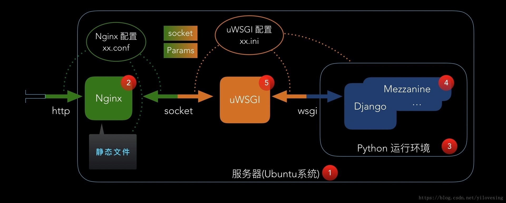

import Meta from './_include/django.md';

<Meta name="meta" />

## 入门指南{#guide}

## 配置选项{#configs}

- 架构图
  

## 管理维护{#administrator}

## 故障

#### 执行 django 启动命令报错？

错误信息：You have 18 unapplied migration(s). Your project may not work properly until you apply the migrations for app(s): admin, auth, contenttypes, sessions.
Run 'python manage.py migrate' to apply them.

解决方案：运行下面的命令后再启动项目  

```
python manage.py migrate
```