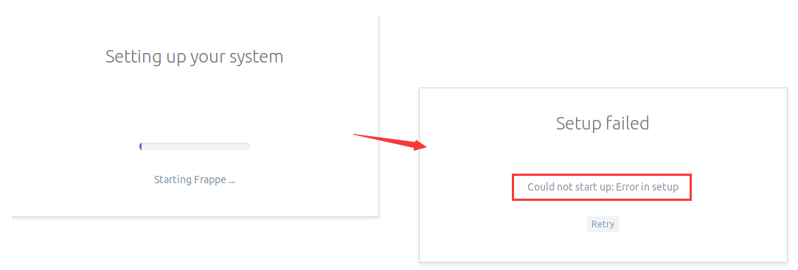

import Meta from './_include/erpnext.md';

<Meta name="meta" />

## 入门指南{#guide}

### 初始化{#wizard}

Websoft9 控制台安装 ERPNext 后，通过 "我的应用" 查看应用详情，在 "访问" 标签页中获取登录信息。  

1. 使用本地电脑浏览器访问 URL，进入登录界面，登录后开始初始化过程，请选择自己的配置完成每一步

2. 安装完成之后，ERPNext 会弹出如下界面
   

   可能会出现安装错误提示，此时需要反复安装：
   


## 配置选项{#configs}

- 多语言（✅）
- SMTP（✅）：控制台【设置】>【电子邮件域名】填写SMTP参数
- [ERPNext Documentation](https://docs.erpnext.com)
- [CLI to manage Multi-tenant deployments for Frappe apps](https://github.com/frappe/bench)
- [API](https://frappeframework.com/docs/user/en/api)

## 管理维护{#administrator}

### 重置管理员密码{#resetpw}

如果用户忘记了 ERPNext 密码，可以通过如下的命令直接设置一个新密码：

```
export GIT_PYTHON_REFRESH=quiet && /usr/local/bin/bench set-admin-password newpassword"
```
### 备份

支持自动备份和命令行备份两种方式： 

- 自动备份（建议）：登录 ERPNext 后，依次打开 【Settings】>【System Settings】
- [命令行备份](https://frappeframework.com/docs/user/en/bench/reference/backup)：`bench --site URL backup`


## 问题与故障

#### 后台 Download Backups 处下载失败？

原因有待研究

#### Frappe，bench，ERPNext？

- ERPNext 是基于 [Frappe](https://github.com/frappe/frappe) 框架开发的免费 ERP 。
- Frappe 是一个用于快速开发JS和Python集成化应用的框架
- [Bench](https://github.com/frappe/bench) 是Frappe框架体系中的 CLI 工具，用于创建和管理基于 Frappe 的应用程序。

Frappe 框架主要由两个部分组成：app 和 site，app 是后端Python代码，site 是用于处理 HTTP 请求的前端部分。

#### ERPNext 服务启动失败？

请确认hostname是否包含字符串 "."，例如 erpnext12.14.0 对于 ERPNext 来说是一个不合规的 hostname

你可以使用下列命令来修改hostname：

```
hostnamectl set-hostname erpnext
```
#### 在Chrome下修改密码后报错？

这个并不是服务器端的问题，只要更新浏览器即可。

#### 运行 Bench 时报错 "You should not run this command as root" when run bench?

Bench 只能通过 frapper 运行,必须先切换到此用户

```shell
su - frapper
```

#### ERPNext 安装向导最后报错？


原因：未知   
方案：重复安装几次直至成功   

#### ConnectionError: Error 111 for erpnext?

ERP 初始化过程会出现 ConnectionError: Error 111 for erpnext 这种错误，[官方回复](https://github.com/frappe/frappe_docker/issues/1314)这是正常现象。因为 Only configuration job container completed, redis connection is correct。  