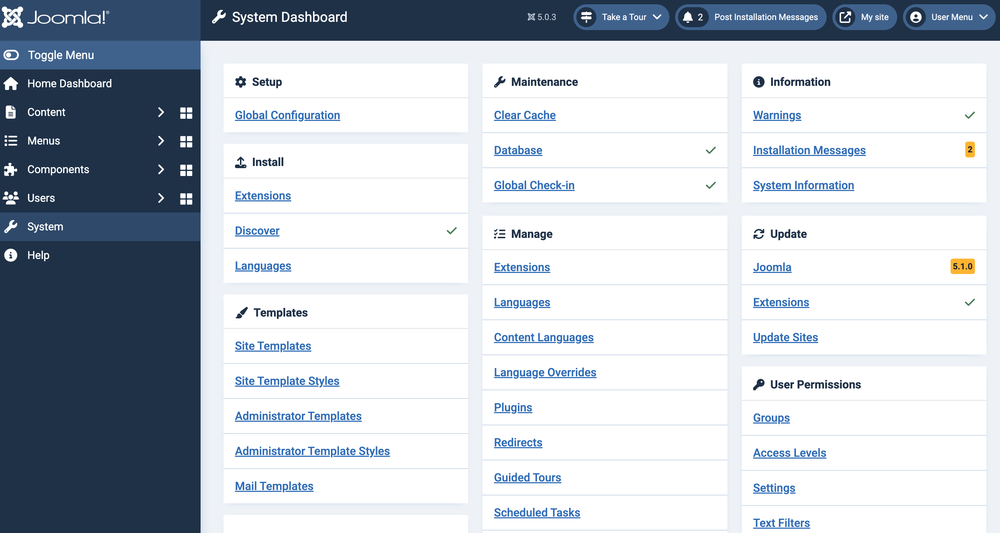

import Meta from './_include/joomla.md';

<Meta name="meta" />

## 入门指南{#guide}

Websoft9 控制台安装 Joomla 后，通过 "我的应用" 查看应用详情，在 "访问" 标签页中获取登录信息。  

Joomla 具有非常全面的管理与配置能力，主要通过 System 菜单进入：

### 安装语言

Joomla 默认为英文，需要其他语言需要登陆后台安装：

1. Joomla 后台：“System” > “Install” > "Languages" 安装所需的语言

2. 编辑用户属性：“Edit Profile” > "Basic Settings" 为前后端分别选择语言，保存后生效

### 安装扩展{#plugin}

1. Joomla 后台：“System” > “Install” > "Extensions" 进入扩展管理界面

2. 选择在线安装的方式（Install from Web）

### 安装模板{#template}

Joomla 的模板安装，主要通过上传模板安装包的方式实现：

1. 准备模板安装包（.zip 文件），模板中不能打包 Joomla 内核

2. Joomla 后台：“System” > “Install” > "Extensions" 进入扩展管理界面

3. 选择上传文件的方式（Upload Package File）进行安装

4. “System” > “Templates” 管理模板

## 配置选项{#configs}

- [Joomla! Extensions Directory™](https://extensions.joomla.org/) 

- SMTP（✅）：后台【系统】>【全局设置】>【服务器设置】，服务器邮件类型选择：SMTP

- 多语言（✅）：后台【扩展管理】>【语言管理】中安装语言，然后可选择所需的语言

- 组件多语言（✅）

- 缓存：后台【系统设置】>【清理过期缓存】

- 配置文件：/path/configuration.php

- [Joomla API](https://api.joomla.org/)

- 后台地址：`http://URL/administrator`

- 在线升级（✅）

## 管理维护{#administrator}

- 在线备份：通过安装 Joomla 扩展 [Akeeda](https://www.akeebabackup.com/download.html)，可以实现后台在线备份

## 故障