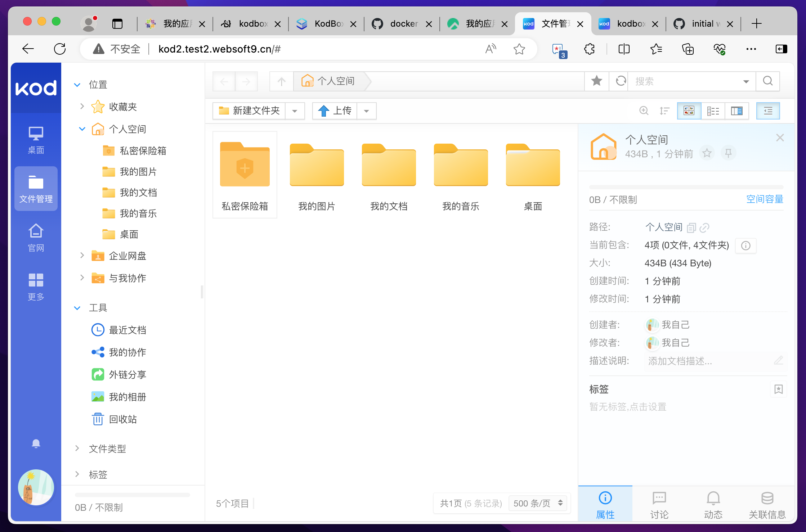
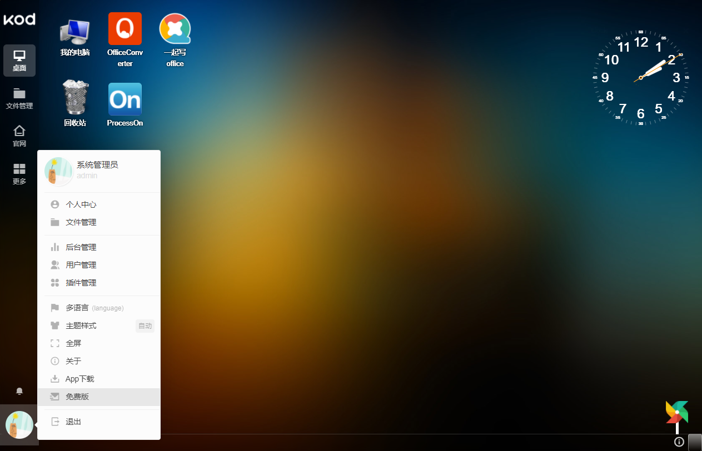

import Meta from './_include/kodbox.md';

<Meta name="meta" />

## 入门指南{#guide}

### 登陆验证{#wizard}

1. Websoft9 控制台安装 KodBox（可道云） 后，通过【我的应用】管理应用，在**访问**标签页中获取登录信息。  

2. 先设置管理员账号，然后登陆后台，默认为文件管理界面
    

4. 桌面管理：点击左边菜单【桌面】，进入系统桌面，常用工具放置在桌面
    

5. 插件管理：点击桌面的【插件中心】，管理系统插件
       

6. 系统设置：点击左下方个人图形，进入个人设置和系统设置（管理员），比如部门、成员、权限等等 
    

## 企业版

KodBox 免费版采用 GPLV3 License，支持用户数 10 个，1个部门。   

Websoft9 是 KodBox（可道云）的企业版合作伙伴，通过 Websoft9 购买企业版，可以获得更多价值：

- 更优惠的折扣
- 与网盘系统，云存储等更多的集成技术服务
- 更全部的解决方案

## 配置选项{#configs}

- 多语言(✅)

## 管理维护{#administrator}

## 故障