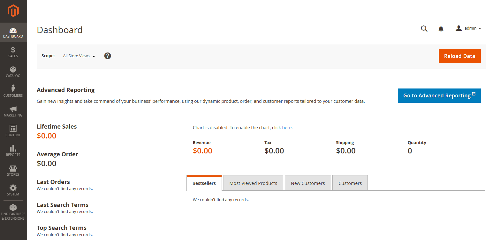

import Meta from './_include/magento.md';

<Meta name="meta" />

## 入门指南{#guide}

### 登录后台{#wizard}

Websoft9 控制台安装 Magento 后，通过 "我的应用" 查看应用详情，在 "访问" 标签页中获取登录信息。  



### 切换为中文{#setlanguage}

Websoft9 已经预制 Magento 的中文包文件 zh_Hans_CN，只需启用它：

#### 后台

以管理员身份登录 Magento，右上角 Account Setting > Interface Local， 选择 Interface Local 为中文

#### 前台

1. 进入 Magento 容器的命令模式，运行下面的命令
   ```
   cd /bitnami/magento/
   php bin/magento config:set --scope=stores --scope-code=default general/locale/code zh_Hans_CN
   php bin/magento cache:clean
   php bin/magento cache:flush
   ```

2. 以管理员身份登录 Magento，打开：Stores > Configuration > General > Locale Options，设置 Locale 为中文


### 安装扩展{#installplugin}

Magento 核心功能之外的补充均称之为扩展，包括：模块、主体和语言包等。

扩展是通过 php composer 连接到 Magento 的 composer 仓库进行操作，安装扩展时需要输入仓库的 [Access Key](#key)   

参考：[Install an extension](https://experienceleague.adobe.com/en/docs/commerce-operations/installation-guide/tutorials/extensions) 


### 设置 Access Key{#key}

Access Key 是 Magento 使用 Marketplace 资源的凭据：

1. 注册 [ Magento 账号](https://account.magento.com/applications/customer/login)，登录 Marketplace，从 My Profile 的 Access Keys 页面新建一个自己的 Access Key

3. 在 Magento 应用的根目录下基于 auth.json.example 创建一个新文件 auth.json

4. 将 Access Key 填写到 auth.json 文件


### 缓存与索引

对 Magento 进行配置后，可能需要刷新缓存或重建索引：

- 通过 Magento 后台设置："System" > "Tools"
- 命令行设置：`php bin/magento cache:flush`, `php magento indexer:reindex`

## 配置选项{#configs}

- [扩展管理](https://experienceleague.adobe.com/en/docs/commerce-operations/installation-guide/tutorials/extensions)

- 命令行： `magento list`

- [API](https://devdocs.magento.com/guides/v2.2/get-started/bk-get-started-api.html)

- 多语言（✅）：需下载语言包后导入

- 在线备份："Stores" > "Configuration" > "ADVANCED" > "Backup Settings"

- SMTP（✅）
  1. 参考 [Email communications](https://experienceleague.adobe.com/zh-hans/docs/commerce-admin/systems/communications/email-communications) 填写 SMTP 参数

  2. "后台" > "商店" > "设置" > "店铺电子邮件地址" > "通用联系方式" 中填写发件人的电子邮箱（与 SMTP 邮箱同名）

## 管理维护{#administrator}


- **更换 URL 额外设置**：Websoft9 控制台更换 Magneto 域名后，还需通过 CLI 更新 Magento URL
   ```shell
   php bin/magento config:set web/unsecure/base_url http://www.mydomain.com/ # 修改成您的实际域名，必须以 / 结束
   php bin/magento config:set web/secure/base_url http://www.mydomain.com/ # 修改成您的实际域名，必须以 / 结束
   ```

- **HTTPS 额外设置**：Websoft9 控制台设置 Magento 的 HTTPS 后，还需通过 CLI 命令进行配置：
  ```
  #1 set your url
  php bin/magento setup:store-config:set --use-secure=1 --use-secure-admin=1 --base-url-secure="https://www.yourdomain.com/"

  #2 flush cache
  php bin/magento cache:flush 
  ```

- **升级**：Magento 升级非常复杂，参考相关文档 
  - [Recommended reading for upgrade planning](https://experienceleague.adobe.com/en/docs/commerce-operations/upgrade-guide/resources/recommended-reading)
  - [Perform an upgrade](https://experienceleague.adobe.com/en/docs/commerce-operations/upgrade-guide/implementation/perform-upgrade)

## 故障

#### Cron job 告警？

错误：One or more indexers are invalid. Make sure your Magento cron job is running     
方案：需重建索引后在后台刷新页面
  ```
  php bin/magento indexer:reindex
  ```

#### Magento 运行很慢？

Magento 是一个复杂的企业级电商系统，对计算资源要求较高

#### 找不到后台登陆地址？

进入 Magento 容器，通过命令一下命令查看或修改：  

```shell
# Show Magento(URL)
magento info:adminuri

# Update Magento(URL)
magento setup:config:set --backend-frontname=[yourAdminUrl] -n
```

#### 重定向导致无法访问？

**现象描述**：错误信息为 ERR_TOO_MANY_REDIRECTS magento admin     
**原因分析**：如果排除 '.htaccess' 文件中的重定向问题，那么最有可能是 URL 导致的   
**解决方案**：通过命令行或  **core_config_data** 数据表修改 URL   

```shell
php bin/magento setup:store-config:set --use-secure=1 --use-secure-admin=1 --base-url-secure="https://www.yourdomain.com/"
php bin/magento cache:flush
```

#### 设置 HTTPS 后，页面混乱？

问题描述：设置 HTTPS 之后，网站可以访问，但是出现页面混乱的情况。    

原因分析：未知  

解决方案：

```shell
php bin/magento maintenance:enable
# 删除静态文件和缓存文件
php rm -rf var/di/* && rm -rf var/generation/* && rm -rf var/cache/* && rm -rf var/page_cache/* && rm -rf var/view_preprocessed/* && rm -rf pub/static/* && rm -rf generated/* 

# 重新 deploy 静态文件
php bin/magento setup:upgrade 
php bin/magento setup:di:compile
php bin/magento setup:static-content:deploy -f

# 重建索引和缓存
php bin/magento indexer:reindex
php bin/magento cache:clean && bin/magento cache:flush
php bin/magento maintenance:disable 
```

#### 商品详情页不能正常显示？

问题描述：前台无法正常显示商品信息，错误 "We can't find products matching the selection"   
问题原因：日志排查后发现是商品属性 "eanl3" 字段异常   
解决方案：“STORES” > "Attributes" > "Product" 重新设置此字段