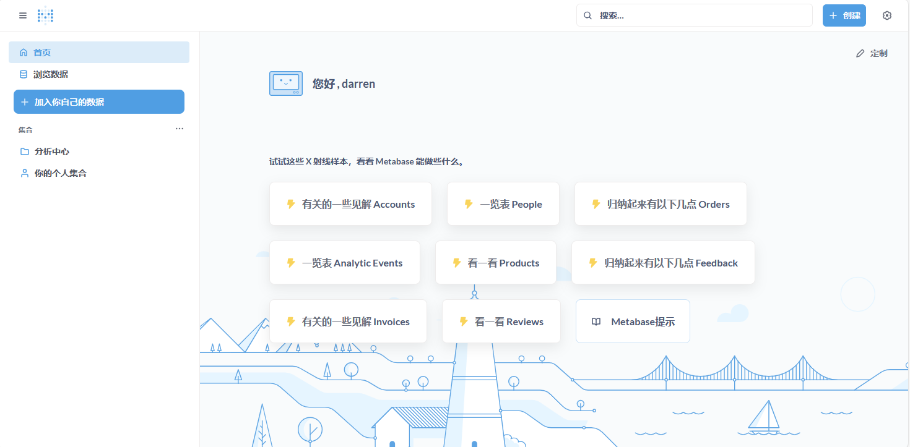

import Meta from './_include/metabase.md';

<Meta name="meta" />

## 入门指南{#guide}

### 登录验证{#wizard}

Websoft9 控制台安装 Metabase 后，通过 "我的应用" 进入它的编辑窗口，在 "访问" 标签页中获取登陆信息。  

1. 使用本地浏览器访问 URL，进入登录界面

2. 登录成功后，根据向导完成信息填写。**添加你的数据** 步骤时，建议选择 **我稍后将添加我的数据**

3. 完成所有步骤后，登录到后台
   

### 增加数据源

登录到 Metabase 后台后，点击右上角图标选择 **管理后台配置** 增加数据源  

## 配置选项{#configs}

- SMTP：控制台 **Settings > email**
- 多语言（✅）：根据浏览器自动选择
- 多用户（✅）
- [Matebase API](https://www.metabase.com/docs/latest/api-documentation.html)

## 管理维护{#administrator}

## 故障
