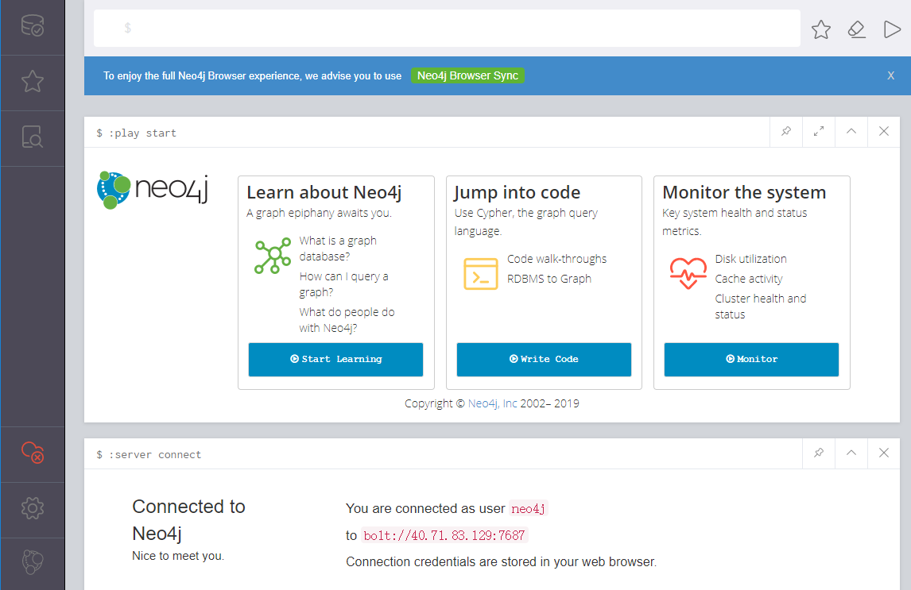

import Meta from './_include/neo4j.md';

<Meta name="meta" />

## 入门指南{#guide}

### 访问 Neo4j Browser{#wizard}

1. Websoft9 控制台安装 Neo4j 后，通过【我的应用】管理应用，在**访问**标签页中获取登录信息。  

2. 本地浏览器访问 Neo4j Browser，填写准确的 Connection URL、账号和密码，即可登录成功
   

3. 左侧 Neo4j Browser Sync 菜单，点击 "Clear local data" 退出登录

### 命令行 Cypher Shell

1. 进入 Neo4j 容器的命令模式，输入 `cypher-shell` 命令

   ```
   $cypher-shell
   username: neo4j
   password: *****
   Connected to Neo4j 4.1.0 at neo4j://localhost:7687 as user neo4j.
   Type :help for a list of available commands or :exit to exit the shell.
   Note that Cypher queries must end with a semicolon.
   neo4j@neo4j>
   ```

2. 输入命令 `CALL dbms.showCurrentUser();` 查看当前用户

   ```
   neo4j@neo4j> CALL dbms.showCurrentUser();
   +--------------------------+
   | username | roles | flags |
   +--------------------------+
   | "neo4j"  | admin  | []    |
   +--------------------------+
   1 row available after 22 ms, consumed after another 1 ms
   ```

3. 用户管理命令（仅企业版）
    ```
    # 显示所有用户
    SHOW USERS;
    CALL dbms.security.listUsers();

    # 创建新用户，第三个参数表示 requridchangepassword 
    CALL dbms.security.createUser('username','password',false);

    # 删除用户
    CALL dbms.security.deleteUser('username');   
    ```

4. 修改密码
   ```
   cypher-shell -u neo4j  -p neo4j  -d system
   ALTER CURRENT USER SET PASSWORD FROM 'neo4j' TO 'neo4j123';
   ```

## 企业版

### 托管服务

Websoft9 可以为 Neo4j 企业版提供全面的采购与托管支持服务。

### 应用场景

* **社交领域**：Facebook, Linkedin 分析每个用户的好友信息，进一步管理社交关系，实现好友推荐
* **零售领域**：零售商和电商平台构建商品之间的关系模型链（读读[《啤酒与尿布》](https://book.douban.com/subject/3283973/)），便于做商品推荐
* **金融领域**：从用户手机通讯录或爬取社交关系，为用户构建一个关系网画像，便于风控和催收
* **汽车制造领域**：汽车制造商零部件供应商的关系图谱，有效降低单台汽车2万个零部件的供应链风险
* **电信领域**：电信运营商公司管理分布全球的复杂网络设施拓扑图，便于更有效的运维。  
* **知识图谱领域**：企查查、天眼查等对于公司和人的关系的知识图谱，可以理解为关系搜索引擎。
* **公共领域**：类似新冠疫情患者出行轨迹的关系图谱，可以更好做出精准排查。

可见，图数据库就用来存储：**人-人， 物-物， 人-物** 之间的关系，用于推荐、知识图谱、效率等目的。  

## 配置选项{#configs}

- 多用户： [User and role management](https://neo4j.com/docs/cypher-manual/current/administration/security/users-and-roles/#administration-security-users) 仅企业版支持

- 开启远程访问：配置文件中增加配置段 `dbms.default_listen_address=0.0.0.0`

- [配置文件](https://neo4j.com/docs/operations-manual/current/configuration)（已挂载）：*/var/lib/neo4j/neo4j.conf*

- 端口说明：[Port on Configuration file](https://neo4j.com/docs/operations-manual/current/configuration/ports/)

- 工具：[Neo4j Tools](https://neo4j.com/docs/operations-manual/current/tools/)

- 命令行：[Cypher Shell](https://neo4j.com/docs/operations-manual/current/tools/cypher-shell/)

- [Neo4j REST API](https://neo4j.com/docs/rest-docs/current/)

- [Neo4j Admin](https://neo4j.com/docs/operations-manual/current/tools/neo4j-admin/)

- [Clustering](https://neo4j.com/docs/operations-manual/current/clustering/)：企业版功能

- [Authentication and authorization](https://neo4j.com/docs/operations-manual/current/authentication-authorization/)

## 管理维护{#administrator}


### 找回密码

Neo4j 官方提供 [Password and user recovery](https://neo4j.com/docs/operations-manual/current/configuration/password-and-user-recovery/) 方案：

1. 配置文件增加配置 `dbms.security.auth_enabled=false`，禁用密码验证

2. 重新设置密码后，复原配置文件 


## 故障

#### 连接数据库报错？ 

问题描述：Neo4j Browser 连接数据库报错。
原因分析：您的服务器对应的**安全组端口**没有开启（入规则），导致无法连接数据库  

#### Roles 显示为空？

Neo4j 社区版不支持 Roles，故显示为空