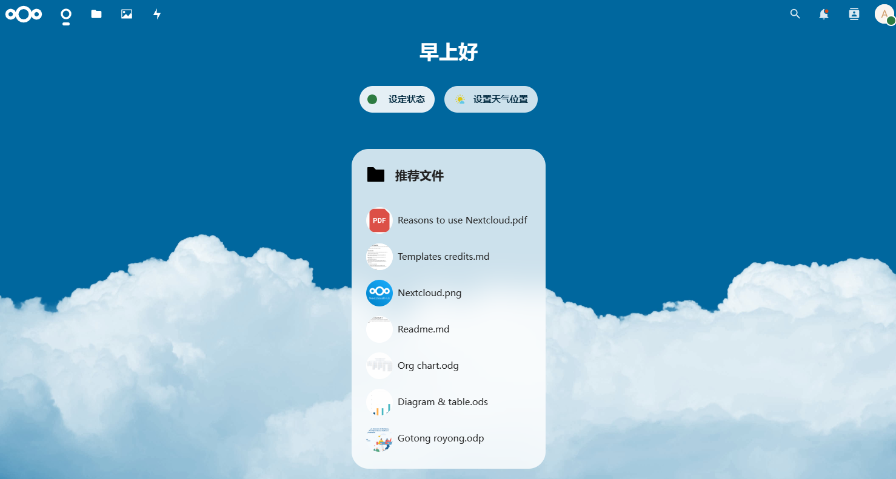
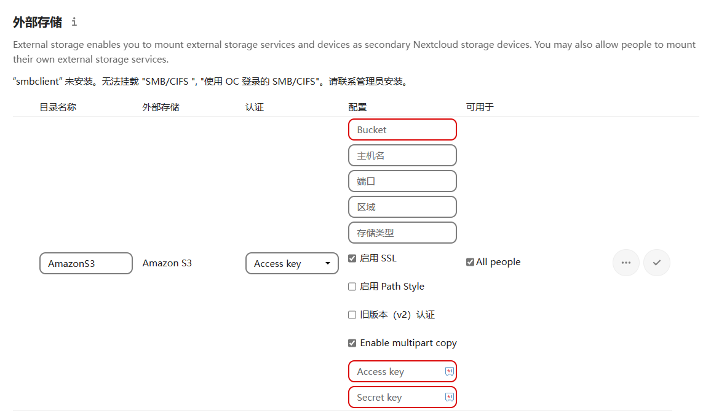

import Meta from './_include/nextcloud.md';

<Meta name="meta" />

## 入门指南{#guide}

### 登录后台{#wizard}

1. Websoft9 控制台安装 Nextcloud 后，通过 "我的应用" 查看应用详情，在 "访问" 标签页中获取登录账号和 URL

2. 访问 Nextcloud 的 URL，登录后台开始使用
   

### 文档预览与编辑{#onlyoffice}

#### 集成 Nextcloud Office

Nextcloud 内置 Nextcloud Office（基于 Collabora Online 开发版，简称 CODE）。 安装 CODE 插件，即可启用

#### 集成 ONLYOFFICE Docs

1. 可选：Websoft9 控制台的 “应用商店”，安装 ONLYOFFICE

2. Nextcloud 控制台右上角齿轮图标，点击 "+应用"，在应用市场 Files 类目，安装 ONLYOFFICE 并启用

3. Nextcloud 控制台右上角齿轮图标，点击 "管理设置"，找到 ONLYOFFICE 设置项，[集成](https://api.onlyoffice.com/editors/nextcloud) ONLYOFFICE
   

4. 安装完成后，找到**设置**页面，对 ONLYOFFICE 进行如图所示的设置（[参考官方文档](https://api.onlyoffice.com/editors/nextcloud)）

### 离线安装应用{#offline}

1. Nextcloud [应用市场](https://apps.nextcloud.com/) 找到应用包的下载网址，并下载到服务器

2. 解压到 Nextcloud 容器 */var/www/html* 目录**对应的服务器挂载点**下的 apps 目录下

3. 进入容器的命令模式，修改应用解压目录的权限
   ```
   chown -R www-data:www-data /var/www/html/apps/appname
   ``` 

4. 登录 Nextcloud 后台，进入应用中心，启用扩展

### WebDAV 服务

WebDAV 用于本地电脑与 Nextcloud 建立一个映射关系：

1. NextCloud 控制台 "文件" > "文件设置"，获取 WebDav URL
2. 本地 Windows 电脑配置 [WebDAV 客户端](https://www.thewindowsclub.com/how-to-map-webdav-in-windows)

### 连接外部存储{#oss}

Nextcloud 支持多种流行的企业存储服务，具体使用步骤如下：

1. 登录 Nextcloud 后台，打开 "应用" > "您的应用"，找到并启用 **External storage support** 

2. Nextcloud 后台的 "管理设置" 中设置外部存储，S3 兼容协议设置范例：

   - Bucket：对应部分厂商的存储桶
   - 主机名：对应部分厂商的 Endpoint
   - Access Key：一般为必填项

   

### 重建索引

将 Nextcloud 数据目录移动或复制到其他位置后，需运行 `occ files:scan --all` 重建索引

### 安全使用 Https

1. Websoft9 控制台进入 “网关” 菜单，编辑 Nextcloud 应用的代理，将 “Advance” 中 “Custom Nginx Configuration” 清空后保存

2. 在 “编排” 中修改 **.env** 文件，将注释行 **#OVERWRITEPROTOCOL=https** 重新放开后重建应用即开启了安全的Https

## 配置选项{#configs}

- App [应用市场](https://apps.nextcloud.com/)（✅）：

- 配置文件（已挂载）：*/var/www/html/config/config.php*

- 多语言（✅）：通过 "个人设置" 配置

- SMTP（✅）：通过 "管理设置" > "基本设置" > "电子邮件服务器" 配置

- [LDAP](https://docs.nextcloud.com/server/latest/admin_manual/configuration_user/user_auth_ldap.html)

- [主流外部存储服务](https://docs.nextcloud.com/server/latest/admin_manual/configuration_files/external_storage_configuration_gui.html#storage-configuration)：Amazon S3、Dropbox、FTP、Google Drive、SMB、WebDAV、SFTP等

- 移动端（✅）：Nextcloud Desktop Client, Nextcloud Android App, Nextcloud iOS App

- CLI：`occ` ，可安装和升级 Nextcloud、管理用户、管理密码等。 

- [Basic APIs](https://docs.nextcloud.com/server/latest/developer_manual/client_apis/WebDAV/basic.html)

## 管理维护{#administrator}

- **修改 URL**：配置文件参数 `overwrite.cli.url`，默认为通配符，即自动任何 URL 变更

- **在线备份**：安装 **[OwnBackup](https://apps.nextcloud.com/apps/ownbackup)** 实现在线备份


## 故障

#### 关闭 ONLYOFFICE 证书验证？

Nextcloud 若为 HTTPS 访问，则ONLYOFFICE 也需 HTTPS，否则连接异常。    

可以通过 Nextcloud 后台插件中设置 或 配置文件中增加下面一段关闭证书验证：  

```
'onlyoffice' =>
array (
'verify_peer_off' =>TRUE,
), 
```

#### 网络超时无法安装应用？

请参考[离线安装应用](#offline)方案
