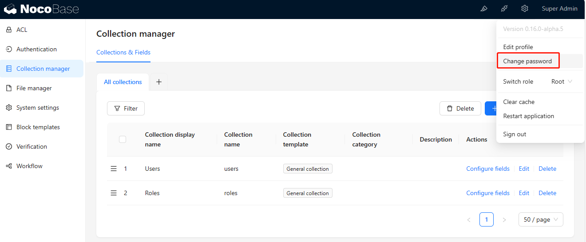

import Meta from './_include/nocobase.md';

<Meta name="meta" />

## 入门指南{#guide}

### 登录后台{#wizard}

1. Websoft9 控制台安装 Nocobase 后，通过【我的应用】管理应用，在**访问**标签页中获取登录信息。  

2. 登录 Nocobase 后台，立即修改密码后再使用
   

## 配置选项{#configs}

- 多语言（✅）

## 管理维护{#administrator}

## 故障
