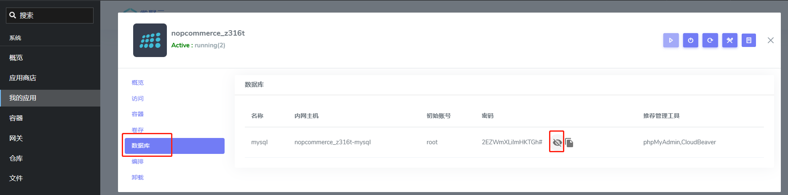

import Meta from './_include/nopcommerce.md';

<Meta name="meta" />

## 入门指南{#guide}

### 初始化{#wizard}

1. Websoft9 控制台安装 nopCommerce 后，通过【我的应用】管理应用

   - 在**数据库**标签页中获取数据库信息
     

   - 在**访问**标签页中获取访问 URL
   
2. 打开访问 URL，开始初始化，其中首先设置管理员账号

3. 接下来，填写数据库信息（此处需仔细填写）

   - 数据库类型：MySQL，并勾选 "如果不存在，创建数据库"
   - 服务器名：第 1 步查看的内网主机
   - 数据库名称：`nopcommerce`
   - 数据库用户名：`root`

   
    
2. 耐心等待安装和 nopCommerce 自动重启过程（1-2分钟）

3. 待前台页面可访问后，通过其右上角的 "Log in" 按钮登录，登录到后台
   

## 配置选项{#configs}

- 多语言（√）

## 管理维护{#administrator}

## 故障