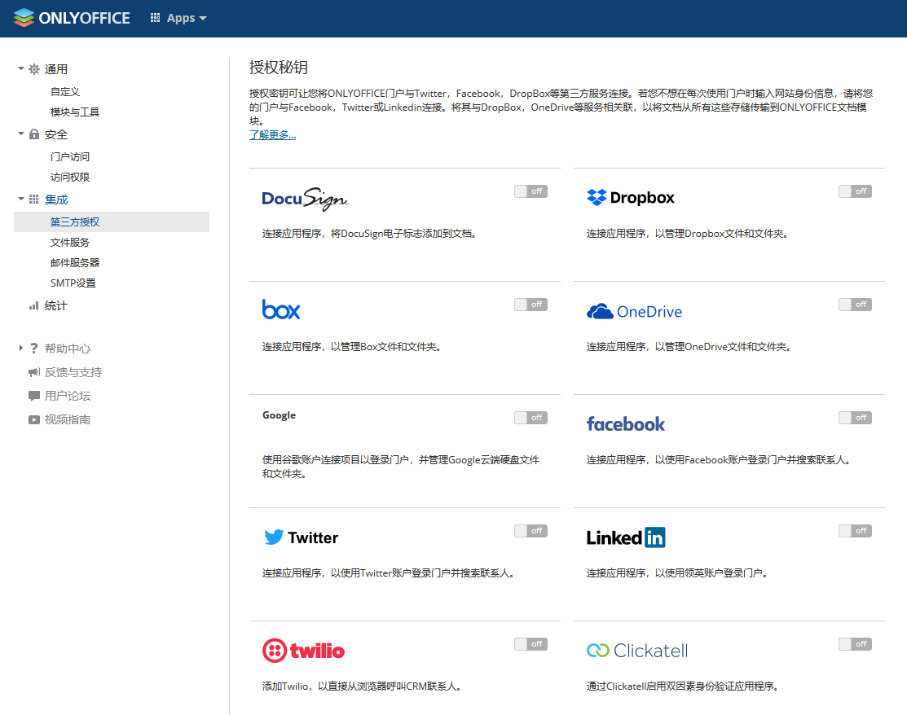

import Meta from './_include/onlyoffice.md';

<Meta name="meta" />

## 入门指南{#guide}

### 初始化{#wizard}

Websoft9 控制台安装 ONLYOFFICE Workspace 后，通过 "我的应用" 查看应用详情，在 "访问" 标签页中获取访问 URL。  

1. 使用本地浏览器访问 URL，进入初始化页面，耐心等2-5分钟，直至出现账号设置界面
   

2. 设置自己的密码和邮箱（登录名），登录后开始使用 
   

### 功能演示

   * **文档管理（可在线编辑）**
     

   * **项目管理**
     

   * **客户关系管理（CRM）**
     

   * **邮件管理门户**
     

   * **第三方集成**
     

## 配置选项{#configs}

- 修改密码：**Administrator > 个人资料 > Log out from all active connections**
- 多语言（✅）
- 邮件服务器（可选）
- [Compare Community Edition and Enterprise Edition](https://github.com/ONLYOFFICE/CommunityServer#compare-community-edition-and-enterprise-edition)

## 管理维护{#administrator}

## 故障

#### RockyLinux 下无法启动？

Onlyoffice 官方反馈目前不支持 RockyLinux，已提交 [Issue](https://github.com/ONLYOFFICE/CommunityServer/issues/509)