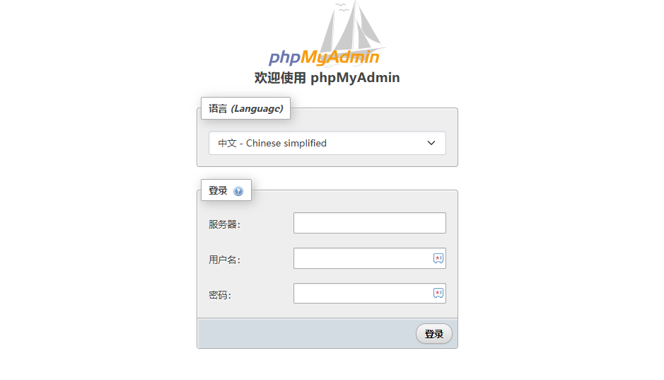

import Meta from './_include/phpmyadmin.md';

<Meta name="meta" />

## 入门指南{#guide}

### 连接 MySQL{#phpmyadminconnect}

1. Websoft9 控制台安装 phpMyAdmin 后，通过 "我的应用" 查看应用详情，在 "访问" 标签页中获取访问 URL。

2. 进入phpMyAdmin 的登录界面，此时需要输入的被连接的 MySQL/MariaDB 的信息
   
   - 服务器：MySQL 主机名（Host），支持内网和外网连接

     - 内网连接：内网IP/容器名/服务名
     - 外网：云数据库厂商提供的主机 URL

   - 账号：root

   - 密码：数据库密码

     

3. 登录成功后，可以方便的管理数据库、运行 SQL

   

### 管理数据库

- 修改密码：phpMyAdmin 首页 > 常规设置 > 修改密码
- 新建数据库：phpMyAdmin 左侧菜单 > 新建
- 新建用户：phpMyAdmin 顶部菜单 > 账户
- 备份恢复：phpMyAdmin 顶部菜单 > 导入或导入

## 配置选项{#configs}

- 多语言（✅）
- 配置文件：/etc/phpmyadmin/config.user.inc.php

## 管理维护{#administrator}

### 远程访问{#remote}

开启数据库的远程访问，只需将 root 账号的主机名修改为任意主机（%）：

1. phpMyAdmin 顶部菜单 > 账户，编辑用户的 "登录信息"
2. 主机名选项中，选择 "任意主机"，点击 "执行" 后生效

### 文件大小限制

phpMyAdmin 默认可导入的文件大小有限制，可通过修改编排文件的 .env 中的 `UPLOAD_LIMIT=20M` 字段。  

## 故障