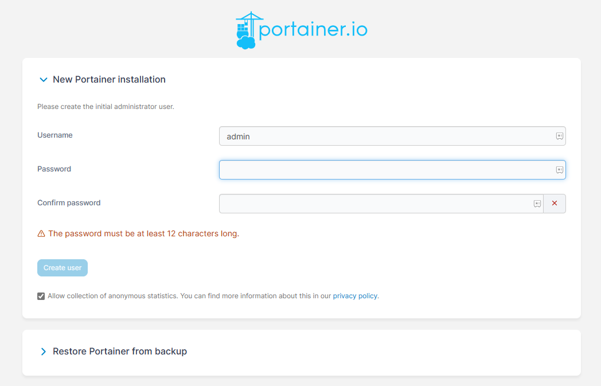

import Meta from './_include/portainer.md';

<Meta name="meta" />

## 入门指南{#guide}

Websoft9 已内置运行的 Portainer，建议直接使用 Websoft9 控制台 "容器" 管理功能。   

如果您已经在 Websoft9 应用商店额外安装 Portainer，请参考下面的指引：

### 初始化

1. Websoft9 控制台安装 Portainer 后，通过 "我的应用" 查看应用详情，在 "访问" 标签页中获取访问网站。  
   

2. 根据向导完成管理员账号设置，进入后台后，系统提示设置 Environments

   - 管理本机的容器（推荐方案）：删除本次安装的 Portainer，直接使用 Websoft9 控制台 "容器" 管理功能

   - 管理本机的容器：修改 Portaier 编排文件，取消 `/var/run/docker.sock` 那行的注释，重建应用后生效

   - 管理非本机的容器，请根据 Environments 提示设置连接方式

3. 完成 Environments 设置及连接后，方可开始管理容器

### 容器中运行命令{#docker-exec}

Portainer 提供了可视化的运行容器命令的功能，它等同于 **docker exec -it**。

1. 在容器列表，点击下图中 MySQL 的 **Quick actions** 一栏下的 **>_** 图标；
    

2. 在新打开的页面，点击 **Connect** 按钮，准备连接；
    

    - Command：选择可用的命令执行（三选一，总有一个可用）
    - user: 默认 root（推荐）

3. 点击 **Connect**，成功连接到即可运行命令

### 在 Portainer 中安装应用{#installapp}

如果 Websoft9 应用商店不满足安装需求，用户可以在容器管理平台中自定义安装 Docker 应用

- Docker-Compose 应用的自定义安装：**容器 > Stacks > Add Stack**
- Docker 容器自定义安装：**容器 > Containers > Add Container**

### 操作指南

参考：[Websoft9 容器指南](./guide/container)

## 配置选项

- 企业版免费范围：5 个节点
- [Portainer CLI](https://docs.portainer.io/advanced/cli)
- [Portainer API](https://docs.portainer.io/api/access)
- 管理 K8s（√）

## 管理维护{#administrator}

## 故障

#### Portainer 无法进入初始页面？

问题原因：为了安全性，Portainer 安装好后几分钟内没进入初始化页面会锁定页面   
解决方案：重启 Portainer 应用

#### 可以删除已有的 Environments 吗？

有运行中的容器后，若删除 Environments 会导致容器无法管理。

####  Websoft9 应用 VS Portarner Stack ？

Websoft9 的应用中的容器是通过 Portainer 的 Stack API 创建的，故 Portainer 可以管理应用对应的容器。  

但是，Websoft9 应用还有更多的内容， 即它们不能完全化为等号
