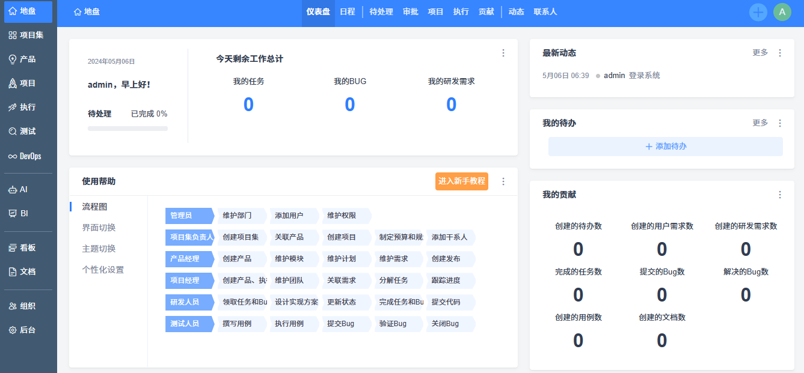

import Meta from './\_include/zentao.md';

<Meta name="meta" />

## Getting Started {#guide}

### Initializing {#wizard}

1. After installing Zentao in the Websoft9 console, view the application details through “My Applications” and access the address in the “Access” tab.

2. Enter the initialization screen and follow the prompts to complete the steps (it is recommended to keep the default database connection settings).

3. After installation, explore the backend.
   

## Configuration Options {#configs}

- Multilingual (✅): Supports backend switching
- Command Line: [Initialization management script](https://www.zentao.net/book/zentaopmshelp/35.html)
- Plugin Marketplace (✅): [Register](https://www.zentao.net/user-register.html) a website account to install plugins online
- Client (✅): Available only for Zentao Professional and Enterprise users
- Zentao Directory (Mounted): _/data_
- Plugin Path (Mounted): _/data/module_
- Git Integration (✅)
- SMTP (✅): **Backend > Notifications > Email**, select SMTP as the sending method

## Administration & Maintenance {#administrator}

- Install Plugins: Supports [Plugin Marketplace](https://www.zentao.net/extension-browse.html) for online installation, or download and extract to the plugin directory for manual installation.
- Reset Password: Modify the `password` field in the **zt_user** table of the database to `e10adc3949ba59abbe56e057f20f883e`, which resets the password to `123456`.
- Online Backup: **Backend > System Settings > Backup**

## Troubleshooting

#### Locked out due to multiple incorrect password attempts?

1. The account will automatically unlock after 10 minutes.
2. The administrator can log in and use the unlock button in the organization → user action bar.
