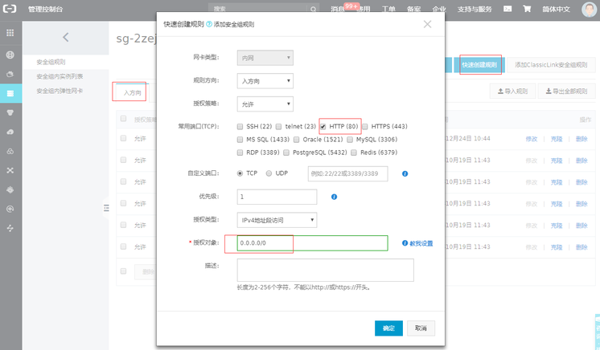

# 阿里云

本章为在 阿里云 上使用 Websoft9 托管平台的用户提供 阿里云 操作的快速指南。

## 快速参考

### 创建 ECS 服务器{#create-ecs}

阿里云 支持多种创建 ECS 服务器的方式，包括：

- 阿里云控制台
- 阿里云 CLI/API/SDK
- 阿里云计算巢
- Terraform

但是，任何一种方式均需要为 ECS 选用或准备所需的镜像


### 管理磁盘{#disk}

阿里云 ECS 提供了丰富的磁盘类型和磁盘管理功能：  

- 磁盘可以从服务器分离
- 支持在线扩容系统盘和数据盘，即无需重启 ECS 实例便可以完成扩容
- 卷转换成快照，快照转换成镜像
- 支持数据云盘

### 磁盘挂载{#mount}

当磁盘扩容后，文件系统的容量并没有增加。这个时候，就需要进行手工的磁盘挂载操作。  

1. 连接服务器，安装 `growpart` 磁盘挂载软件
   ```
   yum install -y cloud-utils-growpart
   growpart /dev/vda 1
   ```
2. 将磁盘挂载到指定磁盘的第一个分区
   ```
   # 挂载到系统盘的第一个分区
   growpart /dev/vda 1

   # 挂载到数据盘的第一个分区
   growpart /dev/vdb 1
   ```
3. 处理扩容后文件系统，以符合 Linux 要求
   ```
   # 适用于 ext 文件系统
   resize2fs /dev/vda1 

   # 适用于 xfs 文件系统
   xfs_growfs /dev/vda1 
   ```


### 管理 IP 与域名{#ip-domain}

- 支持静态 IP 和弹性 IP
- 支持弹性 IP 绑定到 ECS
- 提供域名注册与管理产品服务


### API 导出云市场商品{#exportoffers}

1. 打开阿里云 [API 调试器](https://next.api.aliyun.com/api/Market/2015-11-01/DescribeProducts?lang=JAVA)

2. 其中 **SearchTerm** 填写**长沙网久软件有限公司**。筛选项：key=productType, vaule=MIRROR；

3. 运行 API 后生产所需的数据，

4. 将数据导出为 Json，再将 Json 内容通过 [Jason转Excel](https://jsontoexcel.com/) 工具中导出

    ```
   [

   { 第一个商品  },
   { 第二个商品  },

   { 第n个商品  },
   { 最后一个商品}

   ]
   ```

### 设置安全组{#security-group}

阿里云 控制台提供了对网络安全的直接设置：**服务器 ECS > 网络和安全组 > 安全组配置**



### 导入私有镜像

下面的步骤是对 [阿里云导入镜像流程](https://help.aliyun.com/document_detail/127285.html) 官方文档的简述：  

1. 本地 VMWare 导入 ISO 原生镜像
2. 虚拟机上安装 cloud-init 、安骑士和云助手，关闭防火墙和Selinux
3. 使用 VMWare 导出虚拟机为 OVF 镜像，然后通过[转换镜像格式](https://help.aliyun.com/document_detail/57187.html) 转换为 VDH 格式
4. 将 VDH 文件上传至阿里云 OSS，然后导入私有镜像

镜像导入成功过后，可能仍然存在下面的常见问题：

##### 虚拟机没有网络？

vim /etc/sysconfig/network-scripts/ifcfg-ens33，将ONBOOT=no改为yes，重启后生效

##### 阿里云版本的  cloud-init 安装不上？

尝试安装  cloud-init 社区原版

##### 系统盘无法自动扩展？

这个问题比较复杂，但主要考虑两个方向：

1. 创建虚拟机时磁盘分区尽量简单化，比如说：只设置 1 个分区
2. 系统中安装磁盘自动扩容的插件

### 阿里云 CLI

使用 Websoft9 托管应用时可能用到的 [阿里云 CLI](https://next.api.aliyun.com/) 命令。  

- 查询镜像

    ```
    aliyun ecs DescribeImages --Architecture x86_64 --ImageOwnerAlias system --PageSize 100 --output cols=OSName,ImageId,CreationTime rows=Images.Image[]
    ```

## 配置选项

- 在线 SSH 连接（√）：[Workbench](https://ecs-workbench.aliyun.com), VNC, 发送命令

- 阿里云控制台连接 ECS（√）：**阿里云 ECS 控制台> 连接**

- 在线生成并存储密钥对（√）

- ECS 备份（√）：自动快照和自定义镜像

- ECS 规格调整（√）：**阿里云 ECS 控制台 > 升降配**

- ECS 重置到初始状态（√）

- ECS 更换镜像（√）

- ECS 重置密码（√）

  - 控制台重置
  - 远程连接发送命令重置：`echo "yourpassword" | passwd --stdin root`

- 竞价实例（√）

- 系统盘和数据盘在线扩容（√）

- 云服务器初始化工具：[Cloud-init](https://cloudinit.readthedocs.io/)


## 相关文档

- [阿里云 上部署 Websoft9](./install-alibabacloud)
- [阿里云 ECS 官方文档](https://help.aliyun.com/zh/ecs/)
- [阿里云 CLI](https://help.aliyun.com/zh/cli/)
- [OSS 挂载](https://help.aliyun.com/document_detail/134092.html)
- [阿里云实例故障排查](https://help.aliyun.com/knowledge_detail/127067.html)
- [阿里云机房区域分布](https://help.aliyun.com/document_detail/40654.html)
- [阿里云备案系统](https://beian.aliyun.com/order/index.htm)

## 故障

#### OracleLinux 镜像无法重置密码？

确保上传镜像选择【CentOS】类别，如果是其他类别，就会导致无法在控制台重置密码


#### OSS 作为磁盘很慢？

是正常的，OSS 远不及磁盘的效率。  
