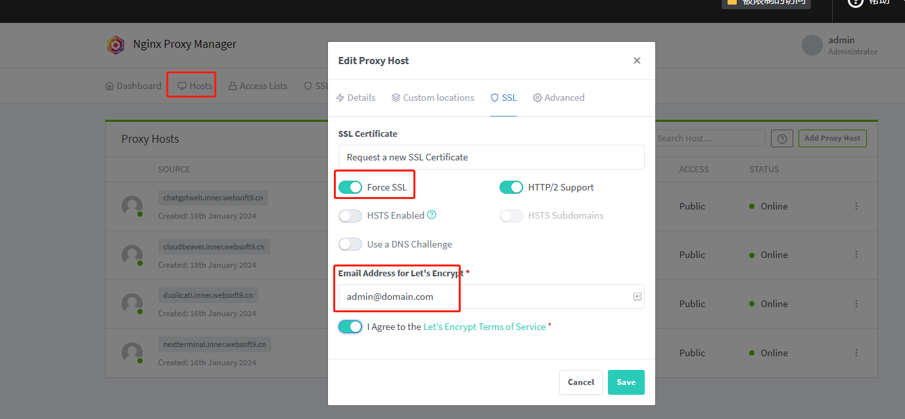
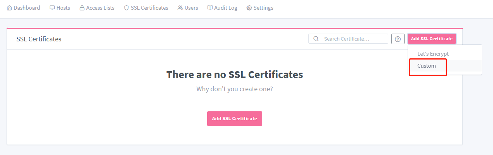

# 设置应用的 HTTPS 访问

HTTPS 是一种网络传输协议，它通过在 HTTP（超文本传输协议）的基础上加入 SSL/TLS 协议，为网站的数据传输加密，保证数据传输的安全性。HTTPS协议的主要目的是提供对网站服务器和浏览器之间的通信路径的加密保护。

Websoft9 控制台的网关模块中支持**可视化的 HTTPS 设置**，支持 [Let's Encrypt](https://letsencrypt.org/) 自动获取证书。   

## 前置条件

必要的：

- 开启服务器安全组的 80, 443 端口
- 应用已经完成了[域名配置](./appset-set.md)，可以通过 HTTP 访问

可选的：

- [上传已有 SSL 证书](#upload)到 Websoft9 控制台

## Websoft9 控制台配置 HTTPS{#console}

1. 登录 Websoft9 控制台，进入**网关**管理界面

2. 打开 "Hosts" > "Proxy Hosts" 菜单后，列出所有应用代理记录

3. 编辑目前应用的记录，进入 "SSL" 标签页，开始设置 HTTPS

   - SSL Certificate：选择一个[已上传的证书](#upload) 或 Request a new SSL Certificate（推荐）
   - Force SSL：是否强制 HTTP 转向到 HTTPS
   - Email Address：填写自己的邮箱，以便于及时了解证书的状态

   

4. 点击 "Save" 后，开始自动配置 HTTPS

5. 若配置失败（在线申请证书可能会不成功），请检查邮箱可用性后再尝试一次

## 第三方网关中配置 HTTPS

下面介绍使用[第三方网关](./gateway-integration)时，通用的 HTTPS 设置注意事项：

1. 尽量保证第三方网关与应用所在的服务器可以内网通信
2. 容器内应用端口需映射到宿主机

## CDN 中配置 HTTPS

下面介绍通用的 [CDN](./gateway-cdn) 或全栈加速下，设置 HTTPS 的注意事项：

1. CDN/全站加速的控制台需设置 HTTPS
2. Websoft9 网关中为应用启用 HTTPS

需要注意的是，两端 HTTPS 必须使用同一套证书。

## 相关资源

- 免费 SSL 证书平台： [ZeroSSL](https://zerossl.com/), [Let's Encrypt](https://letsencrypt.org/) 

## 相关指南

### 为中文域名配置 HTTPS{#chinese}

HTTPS 是不支持中文域名的，如果需要给中文域名配置 HTTPS，操作步骤为：

1. 在域名控制台，正常解析中文域名到服务器 IP

2. 然后，通过 [中国互联网络信息中心](http://www.cnnic.cn/jczyfw/zwym/zgymzcjsy/201206/t20120612_26523.htm) 为中文域名转码。例如：`网久软件.com` 转码为 `xn--3iQsQ211JuqN.com`

3. 为转码后的域名 `xn--3iQsQ211JuqN.com` 设置绑定和 HTTPS 操作

### 上传证书到 Websoft9{#upload}

Websoft9 的网关采用先上传证书，再绑定到 Proxy Host 的这种模式：

1. 登录 Websoft9 控制台，进入网关管理界面的 "SSL Certificates" 栏目

2. 点击右上角 "Add SSL Certificate" > "Custom"，打开上传证书界面
   

3. 上传证书，并检验是否上传成功

4. 上传成功后便可以在 SSL 配置项中引用

### HTTP 自动跳转 HTTPS

1. 登录 Websoft9 控制台，进入网关功能项

2. 编辑目标应用的 "Proxy Host", "SSL" 标签页中勾选 **Force SSL** 即可

### 证书申请失败自检指南

申请证书失败时，可以参考如下几点进行自检：

1. **域名未正确解析**：证书颁发者无法验证域名指向。
2. **通配符证书成本**：免费证书通常不支持多子域名加密。
3. **单域名限制**：证书申请通常限于一个特定域名。
4. **邮箱黑名单**：注册邮箱若被标记为不信任，可能导致申请被拒。
5. **网络超时**：申请过程中的连接问题可能导致验证超时。
6. **域名不被信任**：在申请证书之前为通过 [Let's Encrypt](https://letsencrypt.org/) 的信任检测

### IP 地址申请 HTTPS 证书

可以通过 `openssl` 为 IP 创建自签名证书，但在线的证书颁发机构不支持 IP 申请证书。  

### 验证域名解析可信

当域名解析成功的域名不可信时，Websoft9 网关在线申请证书是无法成功的。  

下面的步骤介绍如何判断解析不可信：  

1. 登录 Websoft9 控制台，进入网关管理界面的 "SSL Certificates" 栏目

2. 点击右上角 "Add SSL Certificate" > "Let's Encrypt"，进入 "Add Let's Encrypt Certificate" 窗口

3. 输入域名，点击 "Test Server Reachability" 按钮

4. 当检测结果包含 "...Invalid domain or IP."，意味着域名被判断为不可信

## 问题与故障

#### 容器内设置 HTTPS 可行否？

有些应用支持通过容器内设置 HTTPS，但适合局域网应用。  

#### 移动端 HTTPS 异常？

问题描述：HTTPS 在 iOS 下可用，而在 Android 不可用    
解决方案：确保 SSLCertificateChainFile 已被采用

#### 连接并非完全安全？

问题描述：HTTPS 设置成功，仍显示“与此网站建立的连接并非完全安全”  
原因分析：网站中存在 HTTP 访问的内部或外部资源  
解决方案：逐一消除 HTTP 资源

#### 

