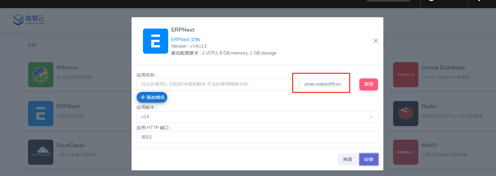

import DocCardList from '@theme/DocCardList';
import {useCurrentSidebarCategory} from '@docusaurus/theme-common';

# 设置应用的域名

用户可以通过 Websoft9 控制台的[网关模块](./gateway)为应用配置域名。  

## 条件

- [准备好可用的域名](./domain-prepare)
- 服务器安全组开启 80, 443 端口

## 全局域名配置{#wildcard}

Websoft9 支持域名的[泛域名解析（Wildcard）](./domain-prepare#wildcard)，自动为每个应用生成独立的子域名，实现了**全局域名**自动分配机制。  

全局域名只需要做一次域名解析和绑定，即可被所有应用使用，具体步骤：

1. 从域名注册服务商的控制台，增加一个**泛域名解析**

   - 域名：websoft9.cn 
   - 记录类型：A
   - 主机记录：*.inner  （注意 *. 的使用，这是泛解析的关键）
   - 记录值：服务器公网IP

2. 解析成功后，可以任意使用以 `inner.websoft9.com` 为**后缀的子域名**。运行 `ping` 命令测试它们
   ```
   ping app1.inner.websoft9.com
   ping app2.inner.websoft9.com
   ping app3.inner.websoft9.com
   ```

3. 登录 Websoft9 控制台，打开 "设置"，在系统设置中填写 "全局域名"，例如：`inner.websoft9.com`
   

4. Websoft9 "应用商店" 任意一个应用，进入 "安装" 状态后，系统就会自动产生：`应用名称.inner.websoft9.com` 类似的子域名
   

5. 应用安装成功后，Websoft9 网关自动为子域名建立应用的绑定的关系，保证应用可以通过子域名访问

## 应用级域名配置{#app-domain}

如果没有[设置全局域名](#wildcard)，就需要为每个应用做一次域名解析和域名绑定操作，我们称之为应用级域名配置。   

Websoft9 支持在 **安装应用时和安装完成后** 为应用设置域名。  

安装应用后设置域名，实际上相当于**更换域名**（更换应用的 URL）。极少部分应用，更换域名非常复杂，需额外配置方可生效。   

因此，建议在安装应用时设置域名。  

### 域名解析

从域名注册服务商的控制台，增加一个**域名解析**。假设域名为：websoft9.cn，解析的设置为：  

   - 记录类型：A
   - 主机记录：erpnext
   - 记录值：服务器公网IP

### 安装应用时设置（推荐）{#pre}

1. 登录 Websoft9 控制台，通过应用商店安装应用

2. 进入应用的 "安装" 界面后，点击 "+添加域名" 按钮，填写解析的子域名，例如：`erpnext.websoft9.cn`
   

3. 应用安装完成后，域名自动绑定并生效

### 安装应用后设置{#after}

1. 登录 Websoft9 控制台，通过 **我的应用** 菜单，打开应用管理的 "访问" 标签页

2. 点击 "添加域名" 按钮，增加所需绑定的**一个或多个域名** （回车行确认每个域名）
   
   

3. 保存后，等待应用自动重建完成后生效

### 绑定多个域名{#multi}

上一步 [安装应用后设置](#after) 即可为应用增加多个域名

## 删除域名

不管是基于全局域名自动产生的子域名，还是单设的域名，都可以通过 Websoft9 应用管理界面删除

## 相关操作

- 域名变更（修改 URL）
- [设置应用的 HTTPS 访问](./domain-https)

## 问题

#### 全局域名与单设域名可并存吗？

可以

#### 可禁用全局域名吗？

可按需禁用。每个应用安装时，都可以为此应用禁用全局域名