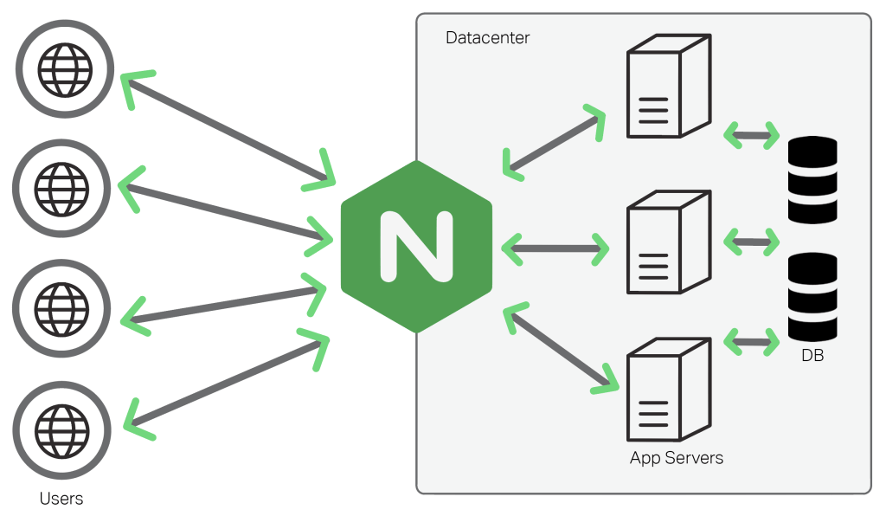

# 了解 Websoft9 Gateway

用户可以通过 Websoft9 网关设置域和安全访问，Websoft9 网关是 Websoft9 的核心组件。  

Websoft9 Gateway 本质上是 [NPM](https://nginxproxymanager.com/guide/)，它完全保留了 NPM 的原生特性和独立开放性。

NPM 以 NGINX 的 **Reverse Proxy（反向代理）** 为核心功能基础，为应用程序提供访问与控制服务：  

- HTTP 反向代理转发
- TCP/UDP 端口转发
- 404 重定向
- 自动化的 SSL 证书申请与续期
- 访问控制与白名单

## 工作原理

在 Websoft9 的架构中，NPM 网关既服务于内部网络中的应用，也为外部用户提供访问入口。作为请求的中转站，NPM 网关接收来自外部客户端的请求，高效地将其路由至后端服务器，并确保响应准确无误地返回给客户端。这一过程让 NPM 网关成为客户端与服务器之间的关键桥梁。

使用网关可以带来多种好处，包括：

- **负载均衡**：反向代理可以将流量分散到多个服务器，提高网站的可用性和性能。
- **缓存静态内容**：可以在反向代理处缓存静态内容，减少后端服务器的负载。
- **SSL 终端**：反向代理可以处理加密的SSL连接，从而卸载后端服务器的加密和解密工作。
- **安全性**：反向代理可以隐藏后端服务器的真实IP地址，为后端服务器提供额外的安全层。
- **压缩和优化**：反向代理可以优化和压缩响应数据，提高传输效率。
- **统一的HTTP入口**：在复杂的应用架构中，反向代理可以作为单一入口点，简化网络流量的管理。

网关是一个独立的功能服务，它有多种使用方式：

- 作为第三方独立网关，为任何类型的应用提供访问控制服务
- 作为 Websoft9 内置网关，为应用自动创建访问控制配置

## 相关文档

- [NPM 官方文档](https://nginxproxymanager.com/guide/)
- [NGINX 官方文档](https://nginx.org/en/docs/)
- [NGINXConfig](https://www.digitalocean.com/community/tools/nginx)

## 问题与故障

#### 修改网关邮件地址后异常？

目前不支持修改网关默认的邮件地址，如果异常需要重置为默认的邮箱地址

#### NPM 支持静态网站吗？

NPM 支持直接运行静态网站，但是需要将 HTML 代码上传到 NPM 容器中，这样就破坏了架构。   

建议的方案：[基于程序环境部署静态网站](./runtime)
