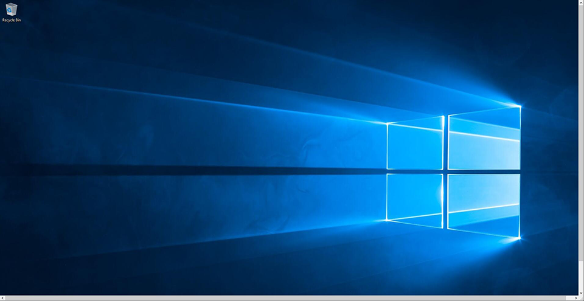

# Windows Server

Websoft9 在云端拥有丰富的 Microsoft 应用程序的经验，可帮助用户获得更高的性能和可靠性、更出色的安全和身份服务、更多迁移支持、广度和深度最高的功能、更低的总拥有成本以及灵活的许可选项。 

Websoft9 还支持构建和运行 Windows 应用程序所需的一切，包括 Active Directory、.NET、Microsoft SQL Server、Windows 桌面即服务以及所有可支持的 Windows Server 版本。利用我们经过实践验证的专业知识，可以帮助您轻松地直接迁移、重构您的 Windows 工作负载，甚至对其进行现代化改造。

## 指南

### 连接 Windows{#connectwindows}

可以通过本地电脑的远程桌面工具 (MSTSC) 连接 Window 服务器。具体步骤如下：

1. 获取需要登录的服务器的**公网IP地址**

2. 选择一种打开本地电脑远程桌面的方式（三选一）:

   - 打开 **开始菜单** -> **远程桌面连接**
   - 打开 **开始菜单**，输入”mstsc“ ，系统会搜索远程桌面连接工具
   - 通过 **Windows Logo** + **R** 打开系统的命令窗口，输入”mstsc“来启动远程桌面连接工具

3. 打开远程桌面连接，输入公网IP地址

   

4. 点击连接，成功后会看到Windows界面
   

5. 远程登录后，就可以直接从本地**拷贝**文件，然后**粘贴**文件到服务器上。
   

### IIS 网站管理

Websoft9 帮助客户在 Windows Server 通过 IIS 部署网站，充分发挥 Windows 平台的出色性能和体验。  

- 绑定域名：IIS 中右键点击需配置域名的网站，选择【编辑绑定】
- 设置伪静态：IIS 需先安装 **[URL重写](https://www.iis.net/downloads/microsoft/url-rewrite)** 组件后，打开 IIS 选择具体的网站，打开 URL 重写工具
- 设置 HTTPS 访问：准备证书后，点击 IIS 的主菜单，在 IIS 的配置页面找到 "服务器证书" 设置项

## 技术栈

### 容器

Windows 系统可以同时支持 Linux 容器 和 Windows 容器两种方案。  

[Windows 容器](https://docs.microsoft.com/zh-cn/virtualization/windowscontainers/)是微软的专项，镜像非常少。它的用途是处理微软开发生态下的编译构建问题。  

Windows 上的 Dockerfile 语法与 Linux 有一定的区别，所幸微软官方针对这些差异提供了较为详细的[文档](https://docs.microsoft.com/en-us/virtualization/windowscontainers/manage-docker/manage-windows-dockerfile)说明。


### SQL Server

Websoft9 提供了在云上开机即用的包含 [SQL Sever](./sqlserver) 的 Windows 托管镜像与服务。

###  Visual Studio CI/CD

我们知道 Visual Studio 除了是一个广泛支持多种开发语言的代码编辑器之外，它也支持多种生成（构建编译）方案：

* IDE
* CMake
* MSBuild 命令行
* Azure Pipelines

[Visual Studio](https://github.com/Websoft9/docker-visualstudio) 所有发行版中均包含 MSBuild。在 Visual Studio IDE 中编写代码，使用 MSBuild 来运行生成

### PowerShell

PowerShell 既可以用在 Windows，也支持 Linux，PowerShell 使用“动词-名词”名称对来命名 cmdlet。    

先运行下面几个命令做做实验，积累具体的使用经验。  

```
# 查看版本
$PSVersionTable

# 调用集成脚本环境
ise

# 显示帮助
help

# 安装 Powershell 软件库
Install-PackageProvider -Name NuGet -Force
```

### SandBox 

SandBox 是 Windows 下的一种虚拟化技术。但它的用法诸多限制：

- 停止即销毁
- 一台 Windows 主机只能创建一个 SandBox

### Windows Admin Center

Windows Admin Center 是适用于在任何地方（物理环境、虚拟环境、本地环境、Azure 或托管环境）运行的 Windows Server 的远程管理工具。

### MSBuild

[MSBuild](https://docs.microsoft.com/zh-cn/visualstudio/msbuild/msbuild) 又名 Microsoft 编译引擎，是一个用于编译应用程序的平台。 Visual Studio 会使用 MSBuild，但 MSBuild 不依赖于 Visual Studio。 通过在项目或解决方案文件中调用 msbuild.exe，可以在未安装 Visual Studio 的环境中安排和编译产品。  

> MSBuild 在 Windows 系统中的地位等同于 Linux 系统中的 CMake。  

Visual Studio 使用 MSBuild 来加载和编译托管项目。 Visual Studio 中的项目文件（.csproj、.vbproj、vcxproj 等）包含 MSBuild XML 代码，当你使用 IDE 来编译项目时，此代码就会运行。 Visual Studio 项目会导入所有必要的设置和编译过程来执行典型的开发工作，但你可以从 Visual Studio 内或通过使用 XML 编辑器对其进行扩展或修改。

```
MSBuild.exe MyProj.proj -property:Configuration=Debug
```

在 Visual Studio 中编译项目与通过 MSBuild 可执行文件直接调用 MSBuild 或使用 MSBuild 对象模型启动编译之间，有一些显著的区别。

### Visual Studio

[Visual Studio](https://docs.microsoft.com/zh-cn/visualstudio/get-started/visual-studio-ide) 主要提供三种版本：

* 社区版
* 企业版
* 专业版

#### 安装

它的安装方式采用的是：通过**安装管理器**进行个性化安装的模式。  


下面简要的对它的安装本质进行说明：  

1. 下载**安装管理器**

2. 选择一种安装方式：图形化方式安装 或 [命令行安装](https://docs.microsoft.com/zh-cn/visualstudio/install/use-command-line-parameters-to-install-visual-studio?view=vs-2019) 或 [命令行+响应文件安装](https://docs.microsoft.com/zh-cn/visualstudio/install/automated-installation-with-response-file?view=vs-2019)
   
   - 图形化安装：双击安装管理器，再根据安装向导安装

   - 命令行安装：进入 PowerShell 或 Shell 窗口，运行下面的安装命令即可

    ```
    # Powershell 命令
    .\vs_Community.exe --installPath C:\minVS --add Microsoft.VisualStudio.Workload.CoreEditor --quiet --norestart

    # Shell 命令
    start /w vs_Community.exe --installPath C:\minVS --add Microsoft.VisualStudio.Workload.CoreEditor --quiet --norestart

    # Shell 命令 + Jason 响应文件
    vs_Community.exe --in customInstall.json
    ```

3. 完成 VS IDE 安装后，并不代表安装了各种不同开发语言所需的组件。因此，VS 在打开项目工程的时候，会检查工程的类型，推荐开发者安装工程所需的引用环境。

如果想下载 VS 的安装包，也需要通过 **安装管理器** 去实现。

如果多个版本，请参考官方的[并排安装方案](https://docs.microsoft.com/zh-cn/visualstudio/install/install-visual-studio-versions-side-by-side)


#### 开发

VS 开发上主要就是设计对象、编辑和检查代码，以及提供一些插件与外部应用相连。  

有几个重要的概念在此列出：

* 在 Visual Studio 中创建应用或网站时，最小单位是**项目**，它包含所有编译为可执行文件、库或网站的文件，项目还包含编译器设置以及程序将与之通信的各种服务或组件需要的其他配置文件。
* 比项目更为宏观的是**解决方案**， 解决方案只是一个“容器”，用于包含一个或多个相关项目，以及生成信息、Visual Studio 窗口设置和不与特定项目关联的任何杂项文件。
* 解决方案中的项目之间不需要有耦合关系

#### 编译

编译是将开发者的代码转变成可允许的软件的过程。通俗的说，编译就是将代码变成软件。  

编译常被称之为：构建、生成的词语。  

编译的过程主要有：

1. 项目代码完整性（自编写代码完整化 + 第三方代码本地化）
2. 编译环境准备
3. 工程中的编译配置文件准备（告诉编译环境你的编译目标）
3. 编译过程（加工）

Visual Studio IDE 自带 C# 和 C++ 等语言的编译环境，故它可以直接编译。它也支持集成：MSBuild, Cmake, DevOps 流水线等第三方编译工具。  

> 从分工的角度，编译环境需从 IDE 中解耦，这样更有利于自动化。

#### 部署

Visual Studio IDE 为了满足开发者一站式的体验，也集成了部署工具。但从分工的角度，部署需从 IDE 中解耦，这样更有利于自动化。  

所以，此处我们不再细说。  


## 配置参数

- IIS 网站根目录： *C:\inetpub\wwwroot*
- 远程桌面端口：3389
- 命令行：[shell](https://docs.microsoft.com/zh-cn/windows-server/administration/windows-commands/windows-commands) 和 [PowerShell](https://docs.microsoft.com/zh-cn/powershell/scripting/overview)。

## 管理维护

### 自动化安装

自动化安装也被称之为静默安装参数（Silent Install  Parameters），它是 Windows 自动化安装中最棘手、最重要的活动。  

[msiexec](https://docs.microsoft.com/zh-cn/windows/win32/msi/command-line-options) 即 [Windows Installer](https://docs.microsoft.com/zh-cn/windows/win32/msi/windows-installer-portal) 是 Windows 上自动化安装最常见的命令行程序。 

    ```
    # 安装程序
    Msiexec /package Application.msi /quiet
    Msiexec /uninstall Application.msi /quiet
    Msiexec /update msipatch.msp /quiet
    Msiexec /uninstall msipatch.msp /package Application.msi / quiet

    # 查询静默安装参数（有些软件不支持）
    ./Application.exe /?

    # 打开记事本
    notepad
    ```

### 分析日志{#logs}

进入到 Windows 系统的**事件查看器**，选择 Windows 日志下的应用程序，然后在右侧的事件列表查看出现错误的应用程序，单击即可在下方弹出详细的错误信息，最后就可以根据错误原因来纠正错误。


## 问题与故障{#troubleshoot}

#### Windows 容器是图形化的吗？

Windows 容器并不支持以 RDP 模式的图形化远程桌面操作，Windows 容器是为持续集成而生。  

#### VS 是否可以被安装到容器？

虽然微软官方没有提供 VS 如何在容器中的部署，但经过试验，证明 VS 也可以被安装到容器。  

VS 中如何在容器中使用，请参考[官方文档](https://docs.microsoft.com/zh-cn/visualstudio/install/build-tools-container?view=vs-2019) 或我们的开源项目 [docker-visualstudio](https://github.com/Websoft9/docker-visualstudio)

#### 无法连接 Windows 远程桌面？{#notconnectwin}

检查账号和密码是正确，请保证 **服务器安全组** 3389 端口是开启的，下图是排查方法  


#### Windows 容器无法访问外网？{#winnonetwork}

在使用某云 Windows 2019 数据中心版（含 Container） 的时候发现网络不通，后面采用如下的办法解决了此问题：

1. 远程桌面登录到服务器
2. 到【网络管理】中禁用本地网络，此时远程桌面断开
3. 到云控制台 VNC 连接中重新远程到服务器，重新开启被禁用的本地网络

以上解决办法的根本原因未知。 
