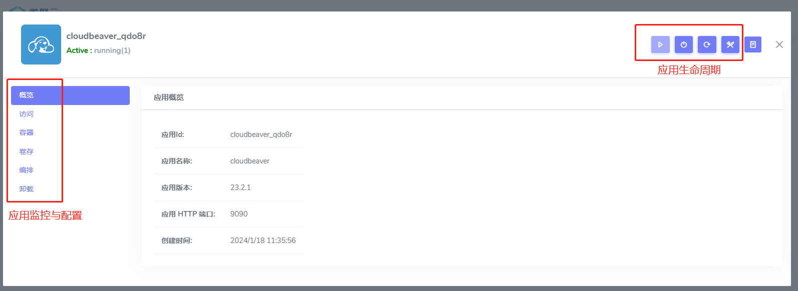

import DocCardList from '@theme/DocCardList';
import {useCurrentSidebarCategory} from '@docusaurus/theme-common';

# 核心功能

Websoft9 控制台"我的应用" 列出所有可管理的应用。  

我们为应用提供了全面的管理、监控、发布和监控的方式：  

本章主要介绍 Websoft9 的核心功能以及典型的设置，帮助用户快速理解功能要点。  

<DocCardList items={useCurrentSidebarCategory().items}/>
