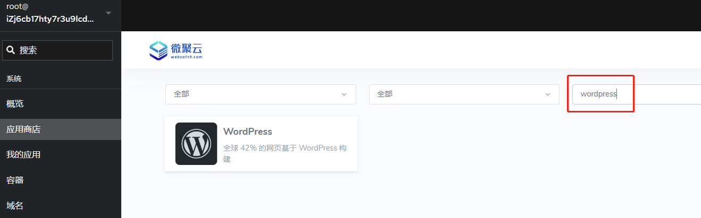
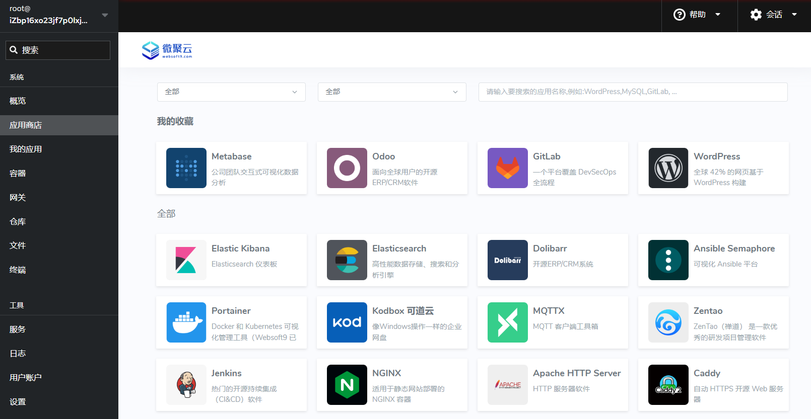

# 搜索 Websoft9 模板化应用

Websoft9 **应用商店**通过一个友好的界面，集中了数百个开源软件和云原生生产力工具的**一键部署模板**。   

它支持分类、筛选和收藏，满足用户快速安装热门应用的需求。

## 分类呈现

Websoft9 应用商店进行了精选的多级分类，包含：数据分析、AI、网站、企业运营、设计创作、低代码、数据库等场景。  

## 关键词搜索

提供应用名称、标题和详情检索，快速找到所需的应用

## 应用详情

应用详情中可以查看截图、版本、资源要求、文档说明等重要信息，便于用户在安装应用之前充分了解应用

## 收藏应用

打开应用详情，可以看到 "收藏" 按钮，把喜欢的应用收藏起来，便于今后快速安装

