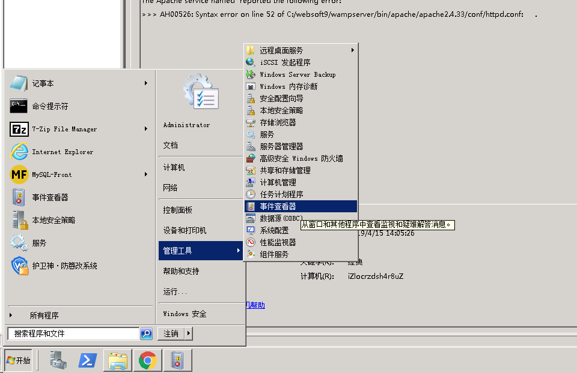

# Windows Server

Websoft9 拥有丰富的 Windows Server 托管经验，能够帮助用户提升性能和可靠性，提供卓越的安全与身份服务，支持迁移，提供广泛而深入的功能，并降低总拥有成本，同时提供灵活的许可选项。   

此为，Websoft9 提供构建和运行 Windows 应用程序所需的一切，包括 .NET、Microsoft SQL Server、Docker 等。凭借我们的专业知识，可以帮助用户轻松实现基于 Windows 的 DevOps 流程。   

## 指南

### 连接 Windows{#connectwindows}

可以通过本地电脑的远程桌面工具 (MSTSC) 连接 Window 服务器。具体步骤如下：

1. 获取需要登录的服务器的**公网IP地址**，并开启服务器安全组的 **3389** 端口

2. 选择一种打开本地电脑远程桌面的方式（三选一）:

   - 打开 **开始菜单** -> **远程桌面连接**
   - 打开 **开始菜单**，输入”mstsc“ ，系统会搜索远程桌面连接工具
   - 通过 **Windows Logo** + **R** 打开系统的命令窗口，输入”mstsc“来启动远程桌面连接工具

3. 打开远程桌面连接，输入公网IP地址

   

4. 点击连接，成功后会看到Windows界面
   

5. 远程登录后，就可以直接从本地**拷贝**文件，然后**粘贴**文件到服务器上。
   

### 使用 IIS 发布网站

IIS 部署网站是 Windows Server 平台上流行的网站发布工具：  

- 绑定域名：IIS 中右键点击需配置域名的网站，选择【编辑绑定】
- 设置伪静态：IIS 需先安装 **[URL重写](https://www.iis.net/downloads/microsoft/url-rewrite)** 组件后，打开 IIS 选择具体的网站，打开 URL 重写工具
- 设置 HTTPS 访问：准备证书后，点击 IIS 的主菜单，在 IIS 的配置页面找到 "服务器证书" 设置项
- IIS 网站根目录： *C:\inetpub\wwwroot*

### 分析日志{#logs}

分析 Windows 系统日志是诊断错误的最直接的方法：

1. 进入到 Windows 系统的**事件查看器**，选择 Windows 日志下的应用程序
   

2. 单击查看目标应用程序的错误详情
   

## 技术栈

### Docker

Windows 系统可以同时支持 Linux 容器 和 Windows 容器两种方案。  

[Windows 容器](https://docs.microsoft.com/zh-cn/virtualization/windowscontainers/)是微软的专项，它的用途是处理微软开发生态下的编译构建问题。  

Windows 上的 Dockerfile 语法与 Linux 有一定的区别，具体参考[官方文档](https://docs.microsoft.com/en-us/virtualization/windowscontainers/manage-docker/manage-windows-dockerfile)说明。


### SQL Server

Websoft9 提供了在云上开机即用的包含 [SQL Sever](./sqlserver) 的 Windows 托管镜像与服务。

### PowerShell

[PowerShell](https://docs.microsoft.com/zh-cn/powershell/scripting/overview) 同时支持在 Windows 和 Linux 上运行，PowerShell 使用“动词-名词”名称对来命名 cmdlet。    

```
# 安装 Powershell 软件库
Install-PackageProvider -Name NuGet -Force
```

### Windows command

参考：[Windows 命令](https://docs.microsoft.com/zh-cn/windows-server/administration/windows-commands/windows-commands)

### Windows Admin Center

[Windows Admin Center](https://www.microsoft.com/en-us/windows-server/windows-admin-center) 是一个集中式的跨平台 Windows Server 的远程管理工具。

### MSBuild

[MSBuild](https://docs.microsoft.com/zh-cn/visualstudio/msbuild/msbuild) 又名 Microsoft 编译引擎，是一个用于编译应用程序的平台。   

MSBuild 不依赖于 Visual Studio 可以单独运行 `msbuild.exe`，它类似 Linux 的 CMake。    

Visual Studio 使用项目文件（.csproj、.vbproj、vcxproj 等）中包含的 MSBuild XML 配置来加载和编译构建。   

也支持直接运行命令构建：     

```
MSBuild.exe MyProj.proj -property:Configuration=Debug
```

### Windows Installer

Windows Installer 是 Microsoft 提供的一套全面的安装打包解决方案，其中自动化安装程序 [msiexec](https://docs.microsoft.com/zh-cn/windows/win32/msi/command-line-options) 被广泛使用。 

    ```
    # 安装程序
    Msiexec /package Application.msi /quiet
    Msiexec /uninstall Application.msi /quiet
    Msiexec /update msipatch.msp /quiet
    Msiexec /uninstall msipatch.msp /package Application.msi / quiet
    
    # 查询静默安装参数（有些软件不支持）
    ./Application.exe /?
    
    # 打开记事本
    notepad
    ```

### Visual Studio for CI/CD

[Visual Studio](https://docs.microsoft.com/zh-cn/visualstudio/get-started/visual-studio-ide) 不仅仅是一个支持多项目、多解决方案级的代码编辑器，它也支持多种编译构建。  

#### 自动化安装 Visual Studio

在 Windows 下安装 Visual Studio 是非常方便的，因为官方提供了安全管理器。  


但是，自动化的 DevOps 场景下，往往在编译构建之前，需通过 [命令行安装](https://docs.microsoft.com/zh-cn/visualstudio/install/use-command-line-parameters-to-install-visual-studio?view=vs-2019) 或 [命令行+响应文件安装](https://docs.microsoft.com/zh-cn/visualstudio/install/automated-installation-with-response-file?view=vs-2019) 实现自动化。


    ```
    # Powershell 命令
    .\vs_Community.exe --installPath C:\minVS --add Microsoft.VisualStudio.Workload.CoreEditor --quiet --norestart
    
    # Shell 命令
    start /w vs_Community.exe --installPath C:\minVS --add Microsoft.VisualStudio.Workload.CoreEditor --quiet --norestart
    
    # Shell 命令 + Jason 响应文件
    vs_Community.exe --in customInstall.json
    ```

#### 编译构建

编译是将开发者的代码转变成可运行的程序的过程。通俗的说，**编译就是将代码变成软件的过程**。    

编译的主要流程：

1. 确保项目代码完整性（自编写代码 + 第三方库）
2. 准备编译环境（环境从 IDE 中解耦，更有利于自动化）
3. 准备项目中的编译的编排文件
3. 运行编译过程

Visual Studio IDE 自带 C# 和 C++ 环境，其他环境需安装。它也支持集成：MSBuild, Cmake, DevOps 流水线等第三方编译工具。  

## 问题与故障{#troubleshoot}

#### Windows 容器包含桌面吗？

Windows 容器并不支持以 RDP 模式的图形化远程桌面操作，Windows 容器是为持续集成而生。  

#### VS 是否可以被安装到容器？

可以，具体请参考：[官方文档](https://docs.microsoft.com/zh-cn/visualstudio/install/build-tools-container?view=vs-2019) 或 [docker-visualstudio](https://github.com/Websoft9/docker-visualstudio)

#### 无法连接 Windows 远程桌面？{#notconnectwin}

检查账号和密码是正确，请保证 **服务器安全组** 3389 端口是开启的，下图是排查方法  


#### Windows 容器无法访问外网？{#winnonetwork}

在使用某云 Windows 2019 数据中心版（含 Container） 的时候发现网络不通，后面采用如下的办法解决了此问题：

1. 远程桌面登录到服务器
2. 到【网络管理】中禁用本地网络，此时远程桌面断开
3. 到云控制台 VNC 连接中重新远程到服务器，重新开启被禁用的本地网络

以上解决办法的根本原因未知。 
 