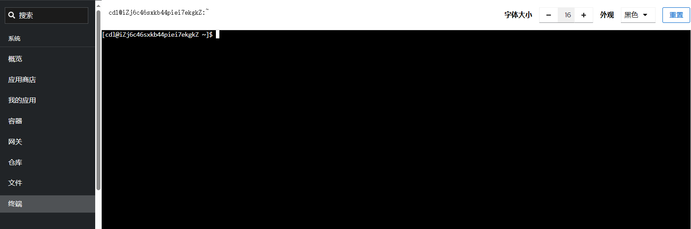

# 连接服务器

连接 Linux 有两种常用的工具类型：

- 本地电脑客户端，例如：Terminus, WinSCP, Putty, Xshell, Tabby, MobaXterm 等
- 在线 Web 客户端：云平台和 Websoft9 控制台均提供的 Web 版在线连接工具  

本章介绍 Websoft9 控制台运行 [在线 Web 客户端](./web-terminal) 的连接 Linux 的方法

## 准备账号{#osaccount}

一般来说 Linux 默认用户名是 `root`，但在某些云平台或发行版，默认的账号并不完全一样。  

具体参考下面的表格：  

   |  云平台   |  管理员账号   | 其他|
   | --- | --- | --- |
   |  Azure   |  创建服务器的时候自行设置   | [如何开启root账户？](./linux#enable) |
   |  AWS   |  AmazonLinux:ec2  CentOS:centos  Ubuntu:ubuntu  Debian:admin   | [如何开启root账户？](./linux#enable)|
   |  阿里云，华为云，腾讯云   |  除腾讯云 Ubuntu 之外(ubuntu)，其他平台任何系统默认账号都是 root  | |

## 运行终端

### 使用独立安全 Web 终端（推荐）{#third}

Websoft9 应用商店安装堡垒机 [Next Terminal](./nextterminal)，实现服务器的安全连接与访问。

### 使用 Websoft9 内置终端{#inner}

Websoft9 控制台内置 Web 终端，它可以免密连接 Websoft9 控制台所在的服务器（局限性），实现命令和文件操作：

- 在线 SSH，可以方便的对服务器进行各种符合权限的操作
    

- 文件管理器，可以方便的对文件进行各种符合权限的操作
   

