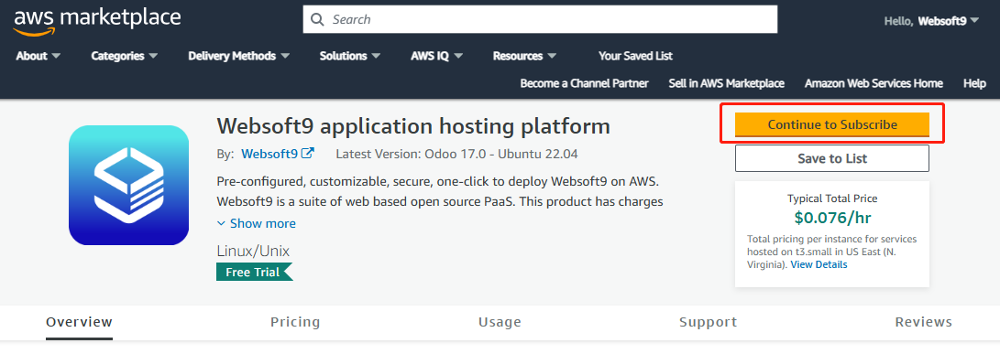

# AWS

Websoft9 在 AWS 提供了预制[云市场镜像](https://aws.amazon.com/marketplace/pp/prodview-5jziwpvx4puq4)，用户可以通过购买的方式实现自动化安装部署 Websoft9 多应用托管平台。

## 先决条件

必须拥有 AWS 的账号：

- 如果你或你的公司已经有一个订阅帐户，请使用该帐户
- 如果没有，可以免费[开设自己的 AWS 帐户](https://aws.amazon.com/cn/free/)，AWS Free Tier 提供 100 多种 AWS 产品

## 规划虚拟机配置

先阅读 [Websoft9 安装要求](./install-requirements)，了解所需的服务器规格、存储和带宽要求。 

另外，在 AWS 上部署 Websoft9 时，需要填写重要的配置参数，下面先提前说明：

- 操作系统磁盘类型，请选择 **SSD** 相关类型
- 安全组端口开启：80, 443, 9000
- 身份验证：密钥对

## 安装 Websoft9

一旦您注册了 AWS 的账号，您可以通过如下多种方式安装 Websoft9：

### 基于 Marketplace 安装

1. 访问 Websoft9 在 [AWS Marketplace 上的镜像商品](https://aws.amazon.com/marketplace/pp/prodview-5jziwpvx4puq4) 

2. 打开商品详情，点击 **Continue to Subscribe** 开始订阅
   

3. 根据提示，逐渐完成后续步骤，直至 **Launch** 

4. 此时，选择启动的入口 Choose Action 
   

   - Launch through EC2 （推荐）
   - Launch from Website
   - Copy to Service Catalog

7. 后续动作基本都会要求用户完成：选择实例类型、VPC、Key Pair等设置

8. 等待几分钟，EC2 创建完成后，镜像会作为 EC2 实例的系统盘启动，即镜像自动部署到实例中

### 基于 Console 安装

1. 登录到 AWS 管理控制台，开始创建一个 EC2 实例

2. 在 **应用程序和操作系统映像** 选项中，通过 **浏览其他 AMI** 进入镜像列表页

3. 在 "AWS Marketplace AMI" 标签栏搜索 **Websoft9 Applications Hosting Platform**，列出 Websoft9 所有产品

3. 任选一个镜像，系统提示订阅，点击【Continue】，开始创建 EC2 实例

5. 后续动作基本都会要求用户完成：选择实例类型、增加存储、配置安全组、设置秘钥对等设置

6. 等待几分钟，EC2 创建完成后，镜像会作为 EC2 实例的系统盘启动，即镜像自动部署到实例中

### 基于 AWS CloudFormation 安装

1. 提前准备部署模板

2. 登录 AWS 门户，将部署模板导入运行

### 基于 AWS Terraform  安装

在 AWS 的 CloudShell 运行 [Terraform](https://developer.hashicorp.com/terraform/tutorials/aws) 部署 Websoft9 的步骤：

1. 安装 Terraform （CloudShell默认使用Amazon Linux）
   ```
   sudo yum install -y yum-utils
   sudo yum-config-manager --add-repo https://rpm.releases.hashicorp.com/AmazonLinux/hashicorp.repo
   sudo yum -y install terraform
   terraform -install-autocomplete
   ```

2. 在 AWS 平台准备：密钥对，安全组等资源，然后编写如下的 `main.tf`，并运行 `terraform fmt` 和 `terraform validate` 检测代码
   ```
   terraform {
   required_version = ">= 1.4.0"
   required_providers {
      aws = {
      source  = "hashicorp/aws"
      version = ">= 5.0.0"
      }
   }
   }

   provider "aws" {
   region = "us-east-1"   #区域
   }

   resource "aws_instance" "example" {              # 资源名称
   ami             = "ami-06409e015d6e1bf5c"        # Websoft9 平台的AMI
   instance_type   = "t2.micro"                     # 实例类型
   key_name        = "websoft9_auto"                # 密钥对名称
   vpc_security_group_ids = ["sg-1240356f"]         # 安全组ID
   tags = {                                           
      Name = "Websoft9  Platform"
      }
   }

   ```

3. CloudShell 运行部署相关命令
   ```
   # init 
   terraform init

   # deploy
   terraform apply

   # destory
   terraform destroy

   # query status
   terraform show
   ```

## 完成虚拟机部署

选用以上任意安装方式，AWS 都会开始部署新的 EC2。  

部署过程需要几分钟才能完成。完成后，通过 AWS 的控制台查看新的 EC2 的信息。  

## 后续配置 Websoft9

EC2 可用之后，参考下面的步骤设置完成后续操作：

1. 登录 AWS 的 **EC2 Dashboard**，在线连接 EC2

2. 运行下面的命令设置 root 密码
   ```
   sudo su
   passwd
   ```
3. 登录 Websoft9 控制台，完成[配置域名](./domain-set)等后续操作

