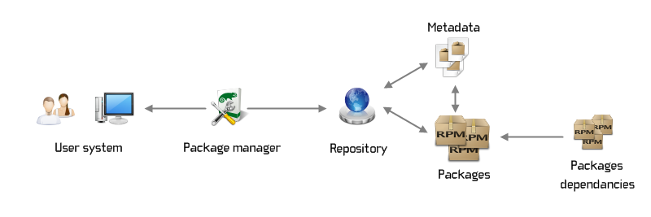

# 仓库

## 镜像仓库{#docker}

* [DockerHub](https://hub.docker.com/)
* [Amazon ECR Public Gallery](https://gallery.ecr.aws/)
* [Microsoft Artifact Registry](https://mcr.microsoft.com/)
* [Oracle Container Registry](https://container-registry.oracle.com/)
* [image at Github](https://github.com/search?q=wordpress+image&type=registrypackages)
* [Docker 中文社区](https://registry.docker-cn.com)
* [RED HAT Quay.io](https://quay.io/search)
* [网易镜像仓库](http://hub-mirror.c.163.com)
* [腾讯镜像仓库](https://mirror.ccs.tencentyun.com)

## Linux 仓库{#binary}

Linux 操作系统都提供了一个集中的软件包管理机制--软件仓库。 

Linux 软件包由：共享库、应用程序（二进制）、服务和文档组成及其所需的依赖列表。

下面我们列出全球比较流行的仓库：

- [Linux Packages](https://linux-packages.com)：软件包的汇聚仓库，包括 Ubuntu、Centos、Arch、Debian
- [Software Collections - scl](https://www.softwarecollections.org/en/)：软件包的汇聚仓库，包括 Ubuntu、Centos、Arch、Debian
- [Ubuntu Packages](https://packages.ubuntu.com)：Ubuntu 官方仓库
- [RPM Fusion](https://rpmfusion.org)：Fedora Project or Red Hat 额外的包
- [EPEL](https://fedoraproject.org/wiki/EPEL)：由 Fedora Special Interest Group 维护的 Enterprise Linux（RHEL、CentOS）中经常用到的包
- [RepoForge](http://repoforge.org)：RHEL 系统下的软件仓库
- [PackMan](http://packman.links2linux.org)：OpenSUSE 最大的第三方软件源
- [Remi](https://www.remi.com)：PHP 仓库
- [Gentoo portage](https://www.gentoo.org)：Gentoo Portage 软件源
- [Fedora copr](https://copr.fedorainfracloud.org/)：Fedora 软件源
- [Ubuntu Ports](http://ports.ubuntu.com)：Arm64/Armhf 等平台的 Ubuntu 软件仓库
- [Centos altarch](http://mirror.centos.org/altarch)： CentOS 额外的包
- [IUS](https://ius.io)： RPM 上游软件包
- [ATOMIC](http://www.atomicorp.com/channels/atomic)： CentOS 额外的包
- [Centos altarch](http://mirror.centos.org/altarch)： Atomic RPM 包