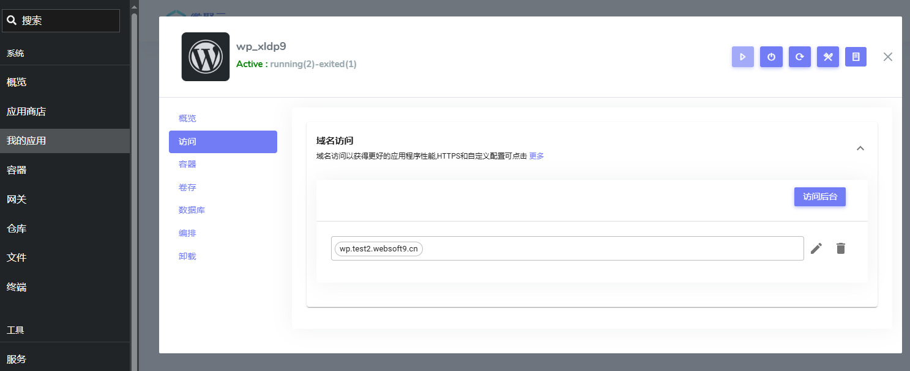

# 全面托管 WordPress

Websoft9 多应用托管平台，可以灵活应对不同的企业级 [WordPress](./wordpress) 托管需求，提供一站式解决方案，节省用户的运营成本。

## 需求规划

企业级的 WordPress 部署，面临诸多特需业务需求和技术挑战：

- **WordPress 站点数量**：需要支持多个 WordPress 站点的部署和管理，以满足不同业务部门或项目的需求。

- **多语言支持**：提供三种可选的多语言实现方式，以适应国际化业务需求：
  - 在线自动翻译：通过集成翻译服务，实现内容的自动翻译。
  - 页面级维护多语言：在同一站点内，通过插件或主题支持多语言内容的维护。
  - 每个语言部署为一个独立的站点：为每种语言单独部署独立的 WordPress 站点，实现完全独立的内容管理。

- **图片与视频分离**：将图片和视频等静态资源与主站点分离，使用独立的存储服务（如对象存储）以提高网站加载速度和性能。

- **备份**：提供全面的备份解决方案，包括自动定时备份和手动备份，确保数据安全和灾难恢复能力。

- **网站加速**：通过多种技术手段（如 CDN、缓存插件、优化数据库等）提升网站的加载速度和用户体验。

- **监控与访问统计**：通过专业工具，监控 WordPress 的健康状态以及获得网站的用户访问数据分析。

## 部署 WordPress

Websoft9 平台可以一键部署任意数量的 WordPress：

1. 登录 [Websoft9 控制台](./login-console)，进入 **应用商店** 窗口

2. 搜索 "wordpress" 关键词，找到 WordPress 并选择安装
   

3. 等待 1-2 分钟，直至 WordPress 安装成功

4. 部署完成后通过 **我的应用** 查看 WordPress 的访问地址
   

## 设置域名与 HTTPS

Websoft9 控制台可以非常方便的为 WordPress 设置域名访问、配置自动 HTTPS 证书等操作。

详情参考相关章节：

- [配置应用域名与安全访问](./gateway)
- [设置应用的 HTTPS 访问](./domain-https)

## 监控 WordPress

Websoft9 控制台提供对 WordPress 基本的监控，包括服务状态、资源占用等。

同时，也支持用户在 Websoft9 应用商店中部署 [Uptime Kuma](./uptimekuma), [Netdata](./netdata) 等专业的监控工具。

详情的使用参考：

- [监控应用的运行](./monitor)

## 统计 WordPress 访问

虽然 WordPress 提供了访问统计相关的插件，但这种方式存在诸多弊端：

- 抢占 WordPress 的计算资源
- 无法提供集中式的网站访问统计界面
- 插件机软件的专业性无法与专业统计软件媲美

Websoft9 应用商店提供了 [Plausible](./plausible), [Umami](./umami), [Matomo](./matomo) 等专业的访问统计工具，一键部署即快速实现专业的统计。  

## 获取 Websoft9 全面支持服务

Websoft9 提供按需付费的专业级 WordPress 服务，确保用户在部署和管理 WordPress 站点时无后顾之忧。  