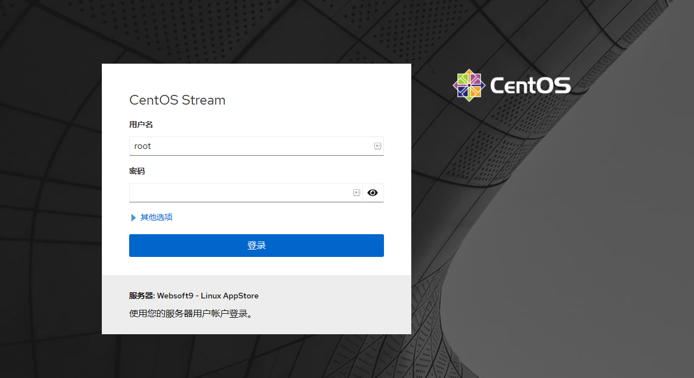

# 登录 Websoft9 控制台

在成功[安装](./install) Websoft9 服务器后，接下来需要登录 Websoft9 控制台进行配置和管理。

## 准备

在登录 Websoft9 控制台之前，请确保完成以下准备工作：

1. **开放服务器安全组入方向端口**：

   - **必要端口**：80, 443, 22, 9000
   - **可选端口**（供应用访问）：9001-9999

2. **获取服务器的账号密码**：

   Websoft9 与服务器共享相同的[账号密码](./credentials)，并有必要的[权限要求](./credentials#convert-normal)。

## 登录 Websoft9

1. 本地浏览器访问： `http://服务器公网IP:9000`，进入 Websoft9 登录界面
   

   - 用户名：Websoft9 所在的 [服务器的账号](./credentials)，首次使用建议 `root`
   - 密码：服务器密码

2. 登录成功后，进入控制台概述页面，显示服务器的状态信息
   

3. 点击 **应用商店**，查看可安装的所有应用模板
   

4. 点击 **我的应用**，查看已安装的应用列表
   

## 相关主题

- [为 Websoft9 设置全局域名](./domain-set#wildcard)
- [使用模板一键部署应用](./appstore-guide)
- [使用程序环境部署应用](./runtime)
