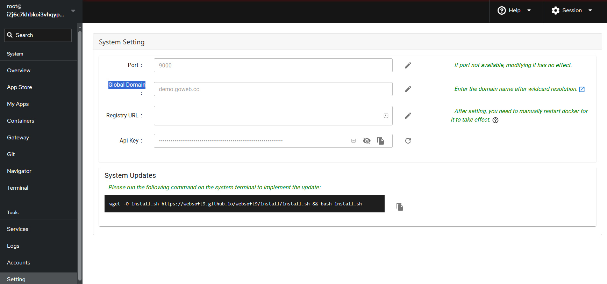

# System settings

Sign in to your Websoft9 instance as an administrator, on the left sidebar select **Settings >System Setting**

## Websoft9 Console port

This sets the access port for the Websoft9 Console, which defaults to **9000**.  

If you change it, you need to make sure that the port corresponding to the security group is open.  

## Global domain

The global domain for Websoft9, it uses wildcard DNS, enabling all applications to share one domain. 

Detail refer to: [Set Global domains for Websoft9](../domain-set#wildcard)

## Registry URL

Add your [docker registry-mirrors](https://docs.docker.com/docker-hub/mirror/) for this settings

## API Key

Click **Reset** button to create API key of Websoft9

## SMTP

The next release has plan

