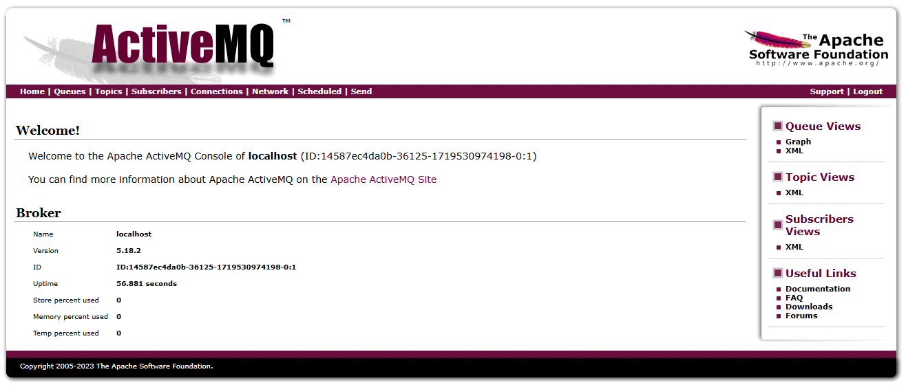

import Meta from './_include/activemq.md';

<Meta name="meta" />

## Getting started{#guide}

## Login ActiveMQ Console

1. When completed installation of ActiveMQ at Websoft9 console, get the applicaiton's overview, credentials and access information from **My Apps**   

2. After accessing using the local computer browser, login to ActiveMQ and you can see the Welcome page
   

3. Open the link **Manage ActiveMQ broker** to management page
   

## Use Guide

Read official documentations [Using Apache ActiveMQ](https://activemq.apache.org/using-activemq) and quickly grasp its usage.  

## Configuration options{#configs}

- [Config ActiveMQ](http://activemq.apache.org/configuration.html)
- [Web Samples](https://activemq.apache.org/components/classic/documentation/web-samples)

## Administer{#administrator}

- Change ActiveMQ Console password: Select By **Websoft9 Console > My Apps > ActiveMQ > Compose > Go to Edit Repository** to edit *.env*

## Troubleshooting{#troubleshooting}
