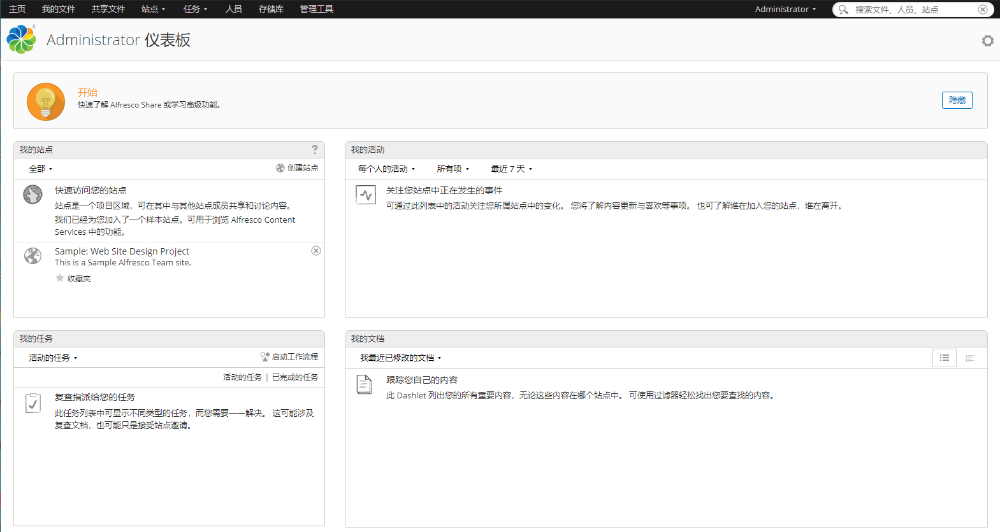
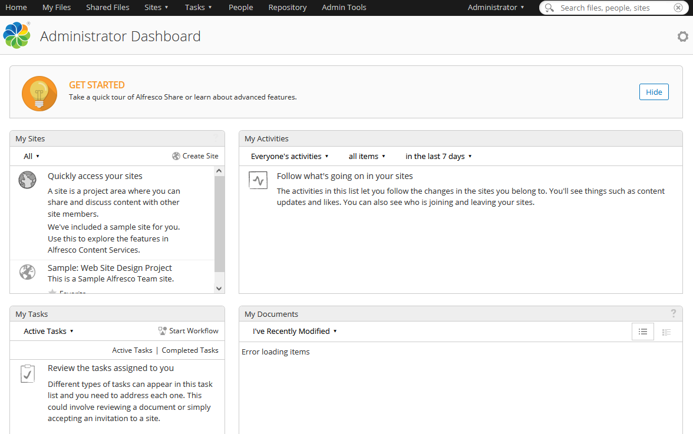
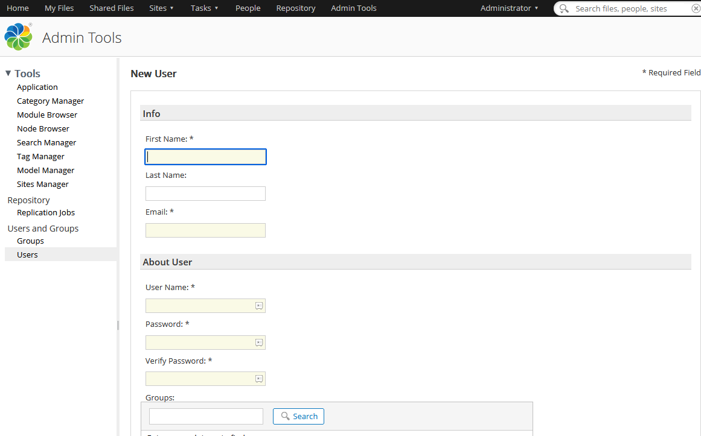

import Meta from './_include/alfresco.md';

<Meta name="meta" />

## Getting started{#guide}

### Login Verification{#verification}

1. Completed installation Alfresco at **Websoft9 Console**, get the applicaiton's overview and access credentials from **My Apps**  

2. Wait 10 minutes for Alfresco to initialize.

3. Local browser access URL, homepage load, then select **Alfresco Repository** > **Alfresco Share** to access the login page

4. Login to the Alfresco console and start using it
   

### Features

The commonly used functions and screenshots are as follows:

- Backend dashboard
  

- My Documents
  

- Shared Documents
  

- Add users
  

- Add Group
  

- Workflow (Approval)
  

### Doc editors

Refer to: [Files and folders](https://docs.alfresco.com/content-services/community/using/content/files-folders/)

## Configuration options{#configs}

- Multilingual(✅): Alfresco will automatically adapt the language based on the client browser, and can also set it up in the background on its own  
- SMTP(✅)  
- [Alfresco Community Edition vs Alfresco Content Services Enterprise](https://www.alfresco.com/alfresco-content-services-enterprise-vs-alfresco-community-edition)
- [Alfresco support file format](https://www.alfresco.com.cn/alfresco-formats)
- Data storage directory: dir.root
- Metadata: Alfreco will automatically [create a metadata file](https://docs.alfresco.com/content-services/latest/develop/repo-ext-points/metadata-extractors/) with the suffix **metadata.properties.xml** for the uploaded file  
- Official document: [Alfresco Documentation](https://docs.alfresco.com/content-services/community/using/content/) 
- Official video: [Alfresco Videos](https://docs.alfresco.com/content-services/latest/tutorial/video/)
- [ReST API Guide](https://docs.alfresco.com/content-services/latest/develop/rest-api-guide/)
- Change password: Alfresco backend, open in the top right corner: **Administrator** > **My Profile**

## Administer{#administrator}

- Reset password: Connect to database, run SQL command `UPDATE alf_node_properties SET string_value='209c6174da490caeb422f3fa5a7ae634' WHERE node_id=4 and qname_id=10`, password reset to **admin**
- [Backup and restore](https://docs.alfresco.com/content-services/community/admin/backup-restore/)

## Troubleshooting{#troubleshooting}

#### Chinese Markdown format preview garbled?

Description: [View in browser] Not garbled, but garbled in Alfreco's built-in document details  
Reason: Unknown  
Solution: Currently unavailable  
