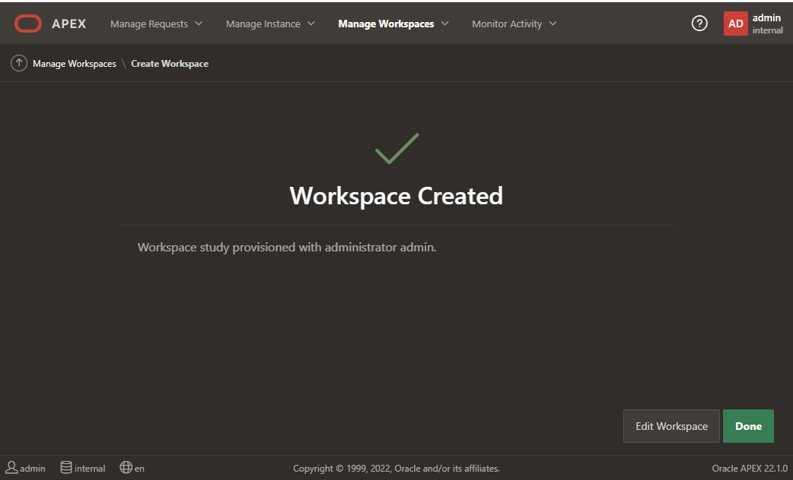

import Meta from './_include/apex.md';

<Meta name="meta" />

## Getting started{#guide}

### Login Verification{#verification}

1. Complete the installation of APEX through the **Websoft9 Console**. You can view the applicaiton's overview and access credentials under **My Apps**.     

2. Wait for 10 minutes until the APEX initialization is complete before accessing the login page.
   

3. After successfully logging in, you will be prompted to change your password and will then enter the APEX console.
       

### Create a WorkSpace{#workspace}

Although APEX includes a default workspace named "internal," it is intended only for administrative purposes.

To use APEX, you must create a new workspace: 

1. Log in to the backend and click Create New WorkSpace
   

2. Follow the wizard: Use the wizard to create a new schema and set up the username, password, and email for the new workspace until you complete the process.
   

### Create an Application

After creating the workspace, **log in with the new workspace** and [create application](https://docs.oracle.com/en/database/oracle/apex/23.2/htmdb/choosing-an-application-creation-method.html). 

## Configuration options{#configs}

- Multilingual (√): Log in to the console to change the language (including Chinese).
- [API](https://apex.oracle.com/api)
- Application Backup: You can easily import and export applications to **APP Builder** from the APEX console to facilitate backup.

## Administration{#administrator}

## Troubleshooting{#troubleshooting}
