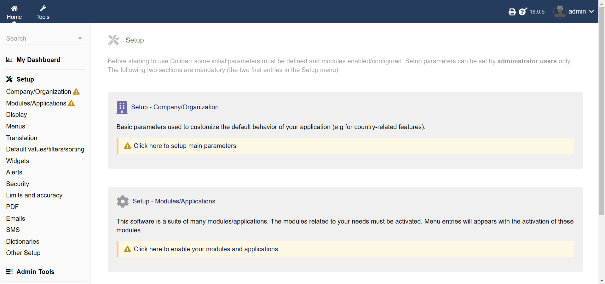

import Meta from './_include/dolibarr.md';

<Meta name="meta" />

## Getting started{#guide}

### Initial setup{#wizard}

1. When completed installation of Dolibarr at **Websoft9 Console**, get the applicaiton's **Overview** and **Access** information from **My Apps**  

2. Login to the backend interface
   

## Configuration options{#configs}

- Multilingual(✅)
- Site Map: */path/dolibarr_html*  
- Documents directory: */path/dolibarr_documents*  
- [Module Web Services API REST](https://wiki.dolibarr.org/index.php?title=Module_Web_Services_API_REST_(developer))

## Administer{#administrator}

## Troubleshooting{#troubleshooting}

