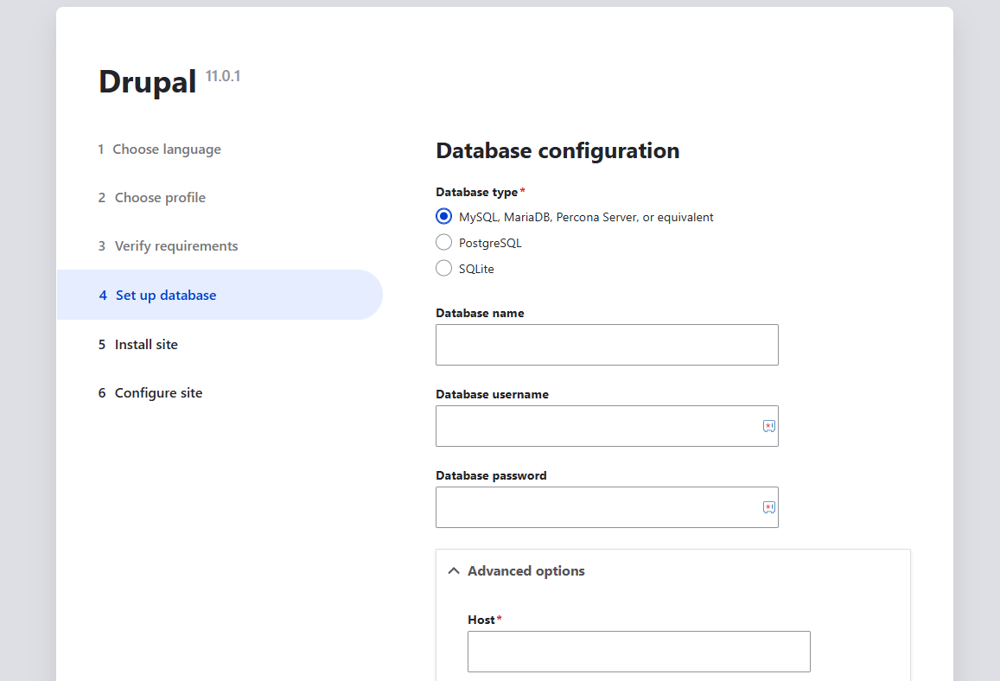

import Meta from './_include/drupal.md';

<Meta name="meta" />

## Getting started{#guide}

### Login verification{#verification}

1. After Completing the installation Drupal in the Websoft9 console, 

  - Obtain the applicaiton's access URL from **Access** tab
  - Obtain **Intranet Host** and **Password** from **Database** tab

2. Local computer browser to access URL, starting the Drupal install wizard

3. The default Database configuration for you with:

   

      - Database type: `MySQL`
      - Database name: `drupal`
      - Database username: `drupal`
      - Database password: **Password** from step1
      - Advanced options > Host: **Intranet Host** from step1

   > You can fill other cloud database if you don't want to use the default

4. Complete the next steps

### Setting up multilingual{#setlang}

Drupal supports multiple languages, but you need to follow these steps:

1. Log in to the Drupal, and install the desired language via **Admin > Configuration > Region and Language**.

2. After installing a new language, set it as the default language.

### Install themes and modules

1. Download themes from [Drupal Themes](https://www.drupal.org/project/project_theme) or modules from [Drupal Modules](https://www.drupal.org/project/project_module).

2. Go to **Extension Management > Install Extension**, enter the download URL, and start the [installation](https://www.drupal.org/docs/extending-drupal/installing-modules).

3. After a successful installation, enable the theme or module.

## Configuration options{#configs}

- Configuration file: */path/sites/default/settings.php*
- Multilingual (✅)
- SMTP (✅): Install [SMTP Authentication Support](https://www.drupal.org/project/smtp) plugin for SMTP.
- [3rd Party CLI](https://drupalconsole.com/) 
- [APIs](https://www.drupal.org/docs/drupal-apis)

## Administer{#administrator}

- [Reset Password](https://www.drupal.org/node/44164) 

- Changing URLs: Change the value in `.htaccess` in the Drupal root directory with according to the domain name.

- Online backup: Install the Drupal extension [Backup and Migrate](https://www.drupal.org/project/backup_migrate) to enable online backup policies.

## Troubleshooting{#troubleshooting}

#### Error when initializing [Install Translation]?

Description: When installing a translation, you need to download the translation file, which may timeout.  
Reason: poor network connection.  
Solution: Retry several times until it succeeds.

#### Drupal status report has an error?

This **Error** is actually a **Warning** and can be ignored.

#### Protecting against HTTP ...?

Description: In Drupal version 8.x or above, after installation, it prompts **Protecting against HTTP HOST Header attacks**.  
Reason: Domain format error  
Solution: Go to the `settings.php` file in the Drupal directory and insert the domain name as follows:
  ```
  $settings['trusted_host_patterns']=['^www\.webosft9\.com$'];
  ```

#### Still suggesting security vulnerability after installation?

Refer to: [Trusted Host settings](https://www.drupal.org/node/1992030)
