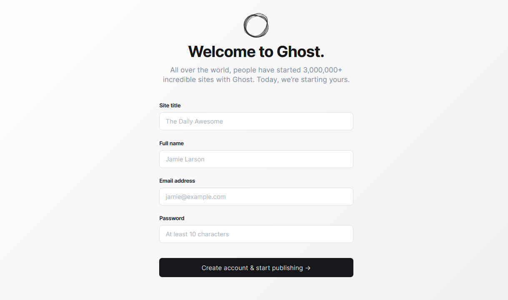

import Meta from './_include/ghost.md';

<Meta name="meta" />

## Getting started{#guide}

### Initial setup{#wizard}

1. After completing the installation of Ghost in the Websoft9 console, get the applicaiton's overview and access information from **My Apps**  

2. Access by `http://URL/ghost`, and complete the installation of wizard  
   

3. Start by creating an administrator account (email address as the username) 

### Multi-language website

Ghost's backend does not support Chinese, but the frontend does (provided that Chinese is included in your theme).

1. Translate the files in the `locales` directory under the theme, where `zh-hans.json` repesents Chinese.

2. Log in to the Ghost backend, click **General** on the left menu bar, expand **Publication Language**, and set its value to `zh-hans`.
  

3. After saving, the changes will take effect immediately.


### Enable Paid Reading

Ghost supports websites in selling articles to customers on a subscription basis, serving as a productivity tool for KM entrepreneurs.

1. Log in to Ghost and click **SETTING > Labs** on the left menu bar.

2. Configure Settings such as Enable members, Connect to Stripe, Subscription pricing, etc.
  


## Configuration options{#configs}

- Code embedding(✅): Ghost backend **SETTING > Code Injection**  

- SMTP(✅): Modify configuration file  

- [Ghost Theme Multilingual](https://ghost.org/docs/faq/translation/) (✅)

- Configuration file(mounted): */var/lib/host/config.production.json*  

- Theme directory(mounted): */var/lib/ghost/themes*  

- [Ghost CLI](https://ghost.org/docs/ghost-cli/)  

- [Content API](https://ghost.org/docs/content-api/)
  
- Subscription for reader (✅): **SETTING > Labs** and configure Enable members, Connect to Stripe, Subscription pricing

- Theme market(✅)  

- Change theme: **SETTING > Design** 

- Custom menu(✅)：**SETTING > Design**

## Administer{#administrator}

- **Change URL**: After changing the domain, you must reset the URL-related values in the Ghost **configuration file** 
   ```
   {
   "url": "http://ghost.yourdomain.com",
   "server": {
      "port": 2368,
      "host": "0.0.0.0"
   }
   ```

- **Configure SMTP**: Modify [mail settings](https://forum.ghost.org/t/how-to-setup-basic-smtp-for-ghost/29166/4) in the configuration file

## Troubleshooting{#troubleshooting}
