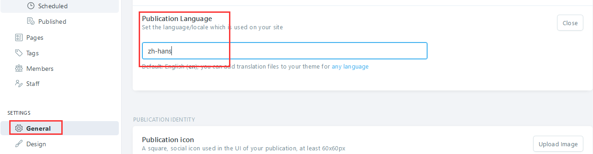
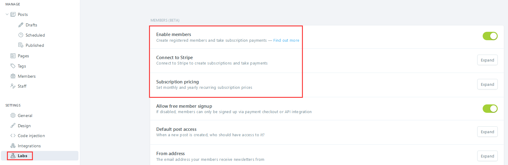

import Meta from './_include/ghost.md';

<Meta name="meta" />

## Getting started{#guide}

### Initial setup{#wizard}

1. When completed installation of Ghost at Websoft9 console, get the applicaiton's overview and access information from "My Apps"  

2. Access using backend address, complete the install wizard  

   

### Multilingual  

Ghost's backend does not support Chinese, but the frontend supports Chinese(if there is Chinese in the theme).  

1. Translate files from the local directory under the theme, where *zh_hans.json* is Chinese  

2. Login to the Ghost backend, click on [General] in the left menu, expand [Publication Language], and set its value to: *zh_hans*  

    

3. Effective immediately after saving

### Enable subscription  

Ghost supports websites selling articles to customers through subscription, making it a productivity tool for knowledge paid entrepreneurs.  

1. Login to Ghost and click on [SETTING]>[Labs] in the left menu

2. Set **Enable members, Connect to Stripe, Subscription pricing** and other items  

   

## Configuration options{#configs}

- Code embedding(✅): Ghost backend[SETTING]>[Code Injection]  

- SMTP(✅): Modify configuration file  

- Multilingual(x): Ghost backend does not support multilingualism, website pages support multilingualism  

- Configuration file(ounted): */var/lib/host/config.production.json*  

- Theme directory(mounted): */var/lib/ghost/themes*  

- [Ghost CLI](https://ghost.org/docs/ghost-cli/)  

- [Content API](https://ghost.org/docs/content-api/)  

- Theme market(✅)  

- Change theme: From the menu bar on the left side of Ghost, select [SETTING]>[Design] and drop it down to the theme setting area  

- Custom menu(✅)： [SETTING]>[Design] in the left menu bar of Ghost

## Administer{#administrator}

- **Change URL**: After changing the domain, it is necessary to reset the URL related values in the Ghost **configuration file** 
   ```
   {
   "url": "http://ghost.yourdomain.com",
   "server": {
      "port": 2368,
      "host": "0.0.0.0"
   }
   ```

- **Configure SMTP**: By modifying the [mail field](https://forum.ghost.org/t/how-to-setup-basic-smtp-for-ghost/29166/4) in the configuration file to send email

## Troubleshooting{#troubleshooting}

#### Changing domain name prevents access to Ghost? 

#### 502 error accessing Ghost?{#502}