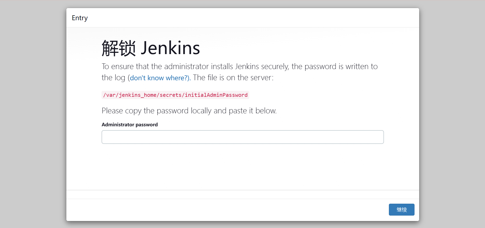

import Meta from './_include/jenkins.md';

<Meta name="meta" />

## Getting started{#guide}

### Initial setup{#wizard}

1. When completing the installation of Jenkins in the Websoft9 console, get the applicaiton's overview and access information from **My Apps**  

2. Access the initialization page, Jenkins will prompt you to unlock it
   

3. Access the Jenkins container and run the following command to retrieve the unlock password

   ```
   cat /var/jenkins_home/secrets/initialAdminPassword
   ```

4. After successfully logging in, complete the following steps: install plugins, create administrators, etc

5. Go to the Jenkins Console and start using it
   

### Github + Jenkins automatic construction

The following steps will help you quickly get started with Jenkins to automatically build and deploy projects on GitHub:

1. Set up **Personal access tokens** in GitHub for Jenkins connection

2. Ensure that the Github plugin is installed and enabled in Jenkins

3. Create a job in Jenkins, configure the source code repository from GitHub, and set the triggering strategy

## Configuration options{#configs}

- Install and manage plugins: **Manage Jenkin > Plugins**

- [Multilingual](https://www.jenkins.io/doc/book/using/using-local-language/)(✅)

- SMTP: Install the Jenkins plugin [Email Extension](https://plugins.jenkins.io/email-ext/), then configure it in **Manage Jenkins > Configure System**

- [Jenkins CLI](https://www.jenkins.io/zh/doc/book/managing/cli/)
   ```
   java -jar jenkins-cli.jar [-s JENKINS_URL] [global options...] command [command options...] [arguments...]
   ```

- [REST API](https://www.jenkins.io/doc/book/using/remote-access-api/)
   ```
   curl JENKINS_URL/job/JOB_NAME/buildWithParameters --user USER:TOKEN --data id=123 --data verbosity=high
   ```

- Online upgrade(✅): When an update is available, the backend will prompt you, allowing you to update and upgrade online through the backend

## Administer{#administrator}

- Backup and Recovery: The [Backup plugin](https://plugins.jenkins.io/backup/) provides backup and recovery capabilities for Jenkins.

## Troubleshooting{#troubleshooting}
