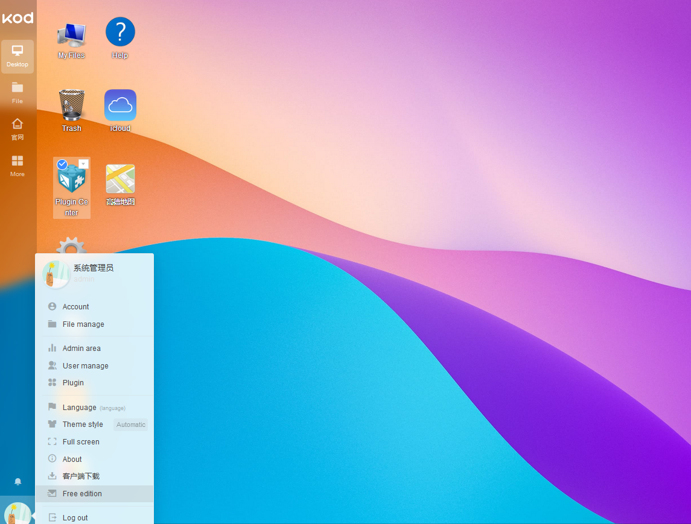

import Meta from './_include/kodbox.md';

<Meta name="meta" />

## Getting started{#guide}

### Login Verification{#verification}

1. Completed installation KodBox at Websoft9 console, get the applicaiton's overview and access credentials from "My Apps"  
    
2. Setup an administrator account first, then login to the backend, which defaults to the file management interface 
    
 
3. Desktop management: Click on the left menu "Desktop" to enter the system desktop, where commonly used tools are placed on the desktop 
    
     
4. Plugin Management: Click on the "Plugin Center" on the desktop to manage system plugins 
      
    
5. System settings: Click on the personal graphic in the bottom left corner to enter personal settings and system settings(administrator), such as department, members, permissions, etc 
    
    
## Enterprise Edition  

The Community Edition of kodbox adopts the GPLV3 License, supporting 10 users and 1 department.  

Websoft9 is KodBox's Enterprise Edition partner, and purchasing the Enterprise Edition through Websoft9 can bring more value:  

- More favorable discounts 
- More integrated technical services with cloud storage systems, cloud storage, and more 
- More comprehensive solutions

## Configuration options{#configs}

- Multilingual (√)

## Administer{#administrator}

## Troubleshooting{#troubleshooting}