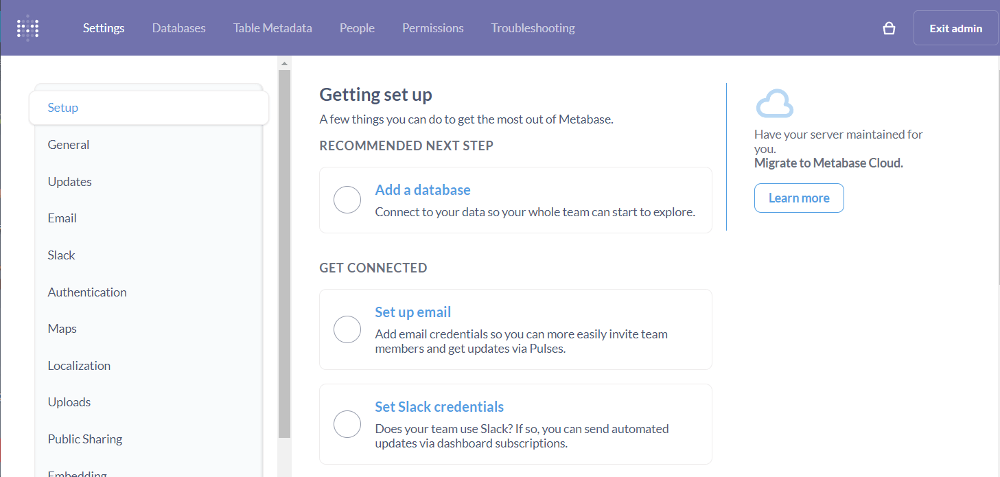

import Meta from './_include/metabase.md';

<Meta name="meta" />

## Getting started{#guide}

### Login verification{#verification}

1. Completed installation Metabase at Websoft9 console, get the applicaiton's overview and access credentials from **My Apps**  

2. Access through URL and enter the login page.

3. After successful login, follow the wizard. when enter **Add your data** step, it is recommended to select **I will add my data later**.

4. After completing all the steps, login to the backend
   

### Add data source

After logging in to the Metabase backend, click the icon in the upper right corner and select **Settings** to add a data source.  

## Configuration options{#configs}

- SMTP: click the icon in the upper right corner and selcet **Settings > General > email**
- Multilingual (✅) : Automatically selected when install.
- Multi-user (✅)
- [Matebase API](https://www.metabase.com/docs/latest/api-documentation.html)

## Administer{#administrator}

## Troubleshooting{#troubleshooting}

