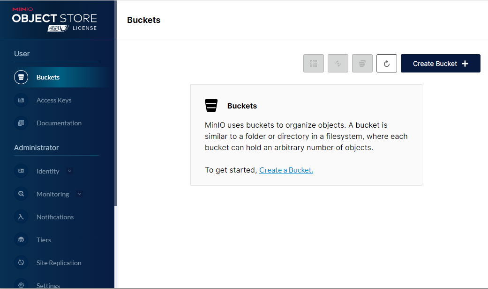

import Meta from './_include/minio.md';

<Meta name="meta" />

## Getting started{#guide}

### Login verification{#verification}

1. After installing MinIO in the Websoft9 console, view the application details through **My Applications** and get the login information in the **Access**.  

2. Using a local computer browser, access the login page

   

3. Enter your account and password to  access the backend

   

### Creating a Storage Bucket

1. Login to the backend and click **Create Bucket** to create a new bucket.

   

2. You can download and preview the uploaded files.
   
   

## Configuration options{#configs}

- Multilingual (x)
- CLI: additional installation required
- Ports: The application has a backend port and an API port.

## Administer{#administrator}

- **Installing the CLI**: From Websoft9 console select **Myapps > Container > Exec console** to attach the MinIO container installs and enables the CLI
   ```
   curl https://dl.min.io/client/mc/release/linux-amd64/mc \
   --create-dirs \
   -o $HOME/minio-binaries/mc
   chmod +x $HOME/minio-binaries/mc
   export PATH=$PATH:$HOME/minio-binaries/

   mc --help    
   ```

## Troubleshooting{#troubleshooting}

