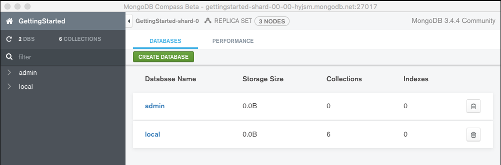

import Meta from './_include/mongocompass.md';

<Meta name="meta" />

## Getting started{#guide}

### Initial setup{#wizard}

1. When completing the installation of MongoDB Compass in the **Websoft9 Console**, get the applicaiton's **Overview** and **Access** information from **My Apps**.  

2. Input your username and password to log in to the desktop environment. 

3. Click the MongoDB Compass icon on the desktop to open MongoDB Compass.
   

4. Select **New Connection > Advanced Connection Options**, enter the connection information and your account details. 
   

   Note: The URI method is not recommended due to its limitations with string format.

5. Once the connection is successful, you will enter the console.
   

## Configuration options{#configs}

## Administer{#administrator}

## Troubleshooting{#troubleshooting}

#### Does MongoDB Compass consume a lot of memory? 

Yes, MongoDB Compass is not a true web application; it is built by Websoft9 as a special container that includes the desktop environment.
