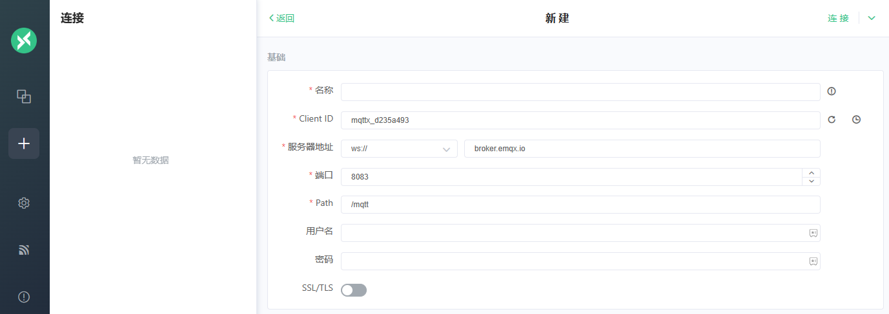

import Meta from './_include/mqttx.md';

<Meta name="meta" />

## Getting started{#guide}

### Login Verification{#verification}

1. Completed installation MQTTX at Websoft9 console, get the applicaiton's overview and access information from "My Apps"  

2. Create a connection 

   - The client ID is automatically generated 
   - Server address: Protocol and address, port are the values of the connected service

   

### Integrate RabbitMQ 

1. Guaranteed RabbitMQ 

   1. Install RabbitMQ on the Websoft9 App Store 
   2. RabbitMQ container command line enable plugin 
      ``` 
      rabbitmq-plugins enable rabbitmq_mqtt 
      rabbitmq-plugins enable rabbitmq_web_mqtt  
      ``` 
2. Create a new RabbiMQ connection in MQTTX to ensure the accuracy of the host, port, account, and connection protocol 

### Integrated EMQX 

1. Prepare EMQX 

   1. Install EMQX on the Websoft9 App Store 
   2. Open the EMQX Dashboard: "Problem Analysis">"WebSocket Client" page, and set **username, password, and protocol version**  for the default WebSocket connection

2. Create a new EMQX connection in MQTTX to ensure the accuracy of the host, port, account, and connection protocol

## Configuration options{#configs}

- Multilingual (√)

## Administer{#administrator}

## Troubleshooting{#troubleshooting}