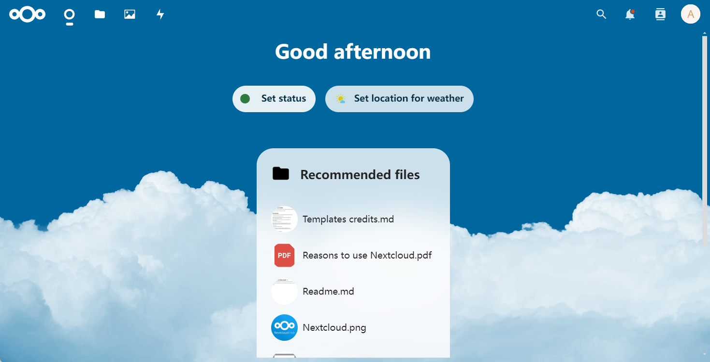
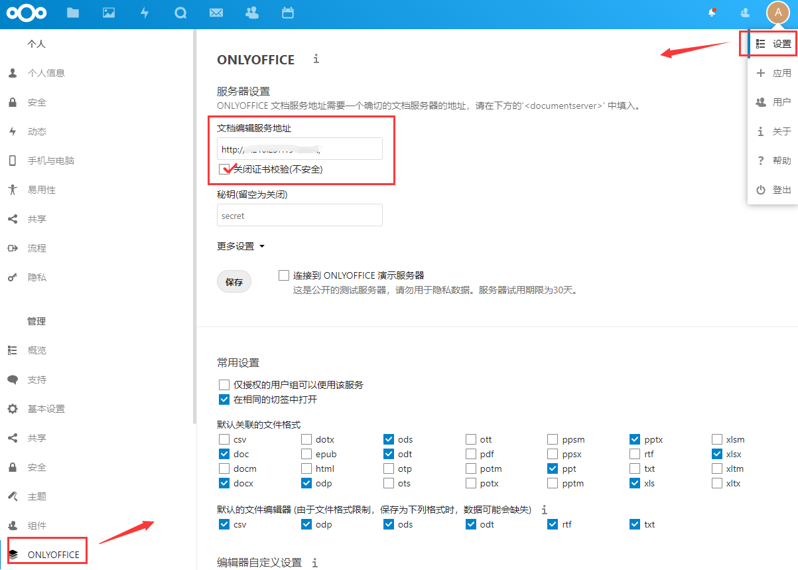
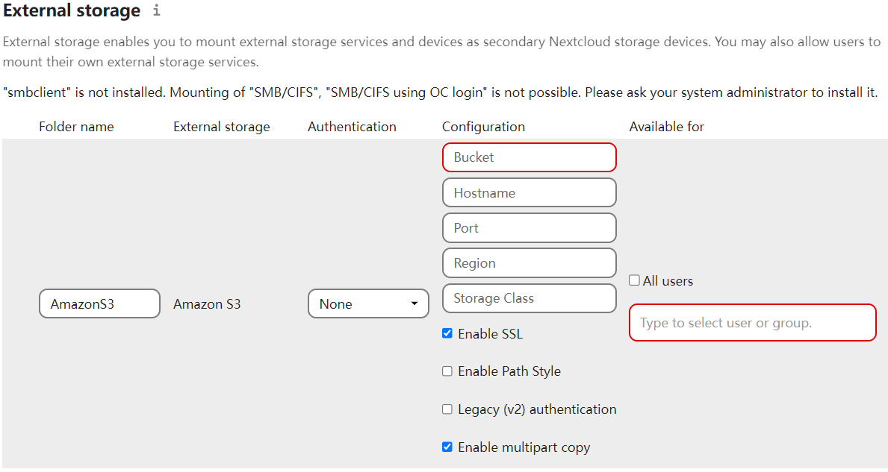

import Meta from './_include/nextcloud.md';

<Meta name="meta" />

## Getting started{#guide}

### Login verification{#verification}

1. When completed installation of Nextcloud at **Websoft9 Console**, get the applicaiton's **Overview** and **Access** information from **My Apps**  

2. Access Nextcloud URL and login to the backend to start.
   

### Document preview and edit {#onlyoffice}

#### Integration of Nextcloud Office

Nextcloud has built-in Nextcloud Office (based on Collabora Online Development Edition, or CODE). Install the CODE plugin to enable

#### Integration with ONLYOFFICE Docs

1. Optional: Websoft9 console **App Store**, install ONLYOFFICE

2. Nextcloud console top right gear icon, select **+Apps > Office & text**, install ONLYOFFICE and enable it.

3. Nextcloud console upper right corner gear icon, select **Administration Settings**, find ONLYOFFICE settings, [Integration](https://api.onlyoffice.com/editors/nextcloud) ONLYOFFICE
   

4. After the installation completed, locate the **SETUP** page and configure ONLYOFFICE as shown ([refer to the official documentation](https://api.onlyoffice.com/editors/nextcloud))

### Install the application offline {#offline}

1. From Nextcloud [App Market](https://apps.nextcloud.com/) find the app package URL and download to server.

2. Extract it to the Nextcloud container */var/www/html/apps* directory.

3. Enter the container CLI and change the permissions of the apps directory.
   ```
   chown -R www-data:www-data /var/www/html/apps/appname
   ``` 

4. Login to the Nextcloud backend, enter the application center, and enable the extension.

### WebDAV service

WebDAV is used to establish a mapping between local computer and Nextcloud:

1. NextCloud console **File > File Settings**, get the WebDav URL.  
2. Local Windows PC configure [WebDAV client](https://www.thewindowsclub.com/how-to-map-webdav-in-windows)

### Connecting to external storage {#oss}

Nextcloud supports many popular enterprise storage services, the steps to use them are as follows:

1. Login to Nextcloud background, select **Apps > Your Apps**, find and enable **External storage support**.  

2. In **Administration Settings** of Nextcloud backend, set up external storage, S3 compatibility protocol settings:

   - Bucket: corresponds to the storage bucket of some vendors.
   - Hostname: corresponds to the Endpoint of some vendors
   - Access Key: Generally required.

   

### Rebuild Indexes

After moving or copying the Nextcloud data directory to another location, you need to run `occ files:scan --all` to rebuild the index.

### Secure use of HTTPS

1. In the Websoft9 console, select **Gateway**, edit the proxy for the Nextcloud application, clear **Custom Nginx Configuration** in **Advance** and save it. 

2. select **My Apps > Compose > Go to Edit Repository > .env** and uncomment the line **OVERWRITEPROTOCOL** to rebuild the application.

## Configuration options{#configs}

- [App Market](https://apps.nextcloud.com/) (✅):

- Configuration file (mounted):*/var/www/html/config/config.php*

- multilingual (✅): Configured through “Personal Settings”.

- SMTP (✅): Configured via **Administration Settings > Basic Settings > Email Servers**

- [LDAP](https://docs.nextcloud.com/server/latest/admin_manual/configuration_user/user_auth_ldap.html)

- [Mainstream External Storage Service](https://docs.nextcloud.com/server/latest/admin_manual/configuration_files/external_storage_configuration_gui.html#) storage-configuration): Amazon S3, Dropbox, FTP, Google Drive, SMB, WebDAV, SFTP, etc.

- Mobile (✅): Nextcloud Desktop Client, Nextcloud Android App, Nextcloud iOS App

- CLI: `occ` for installing and upgrading Nextcloud, managing users, managing password and more. 

- [Basic APIs](https://docs.nextcloud.com/server/latest/developer_manual/client_apis/WebDAV/basic.html)

## Administer{#administrator}

- **Modify URL**: configuration file parameter `overwrite.cli.url`, defaults to wildcard, which can automatically any URL change

- **Online Backup**: install **[OwnBackup](https://apps.nextcloud.com/apps/ownbackup)** to achieve online backup.

## Troubleshooting{#troubleshooting}

#### Disable ONLYOFFICE certificate validation?

If Nextcloud is HTTPS, ONLYOFFICE also needs HTTPS, otherwise the connection will be abnormal.    

You can disable certificate verification by setting in Nextcloud backend plugin or adding the following paragraph in configuration file:  

```
'onlyoffice' =>
array (
'verify_peer_off' => TRUE,
), 
```

#### Can't install apps due to network timeout?

Please refer to the [Install apps offline](#offline) scenario
