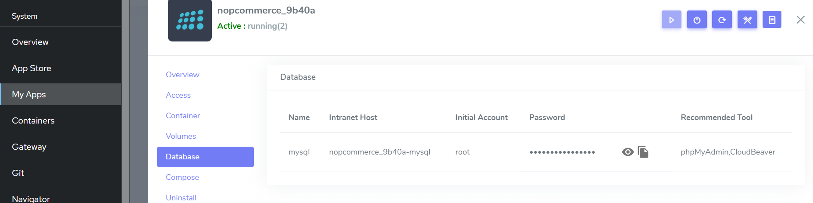
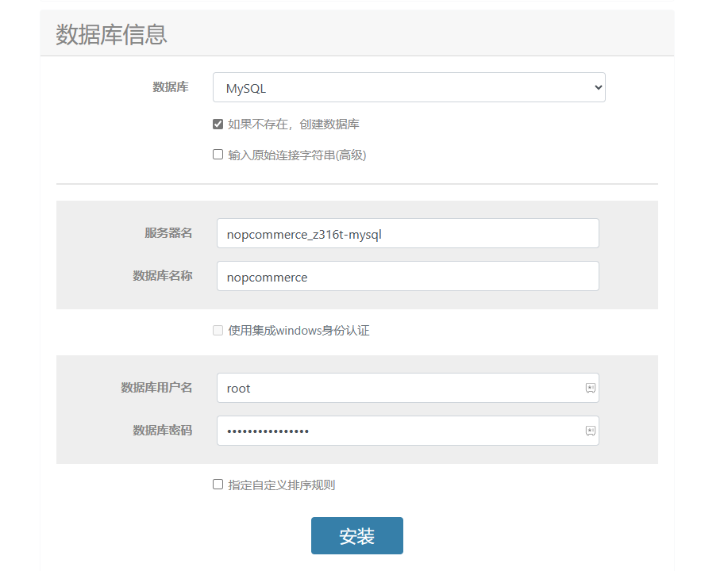

import Meta from './\_include/nopcommerce.md';

<Meta name="meta" />

## Getting Started {#guide}

### Initial Setup {#wizard}

1. After completing the installation of nopCommerce via the **Websoft9 Console**, retrieve the application's **Overview** and **Access** information from **My Apps**.

   - Get the database information from **Database**.
     

   - Get the access URL from **Access**.

2. Access the URL and start the initialization, setting up the administrator account.

3. Carefully fill in the database information:

   - **Database Type**: MySQL, and select **Create database if it doesn't exist**.
   - **Server Name**: The intranet host that you checked in step one.
   - **Database Name**: `nopcommerce`
   - **Database Username**: `root`
     

4. Wait for the installation and nopCommerce automatic restart (1-2 minutes).

5. Once the frontend page is accessible, log in to the backend.
   

## Configuration Options {#configs}

- Multilingual (√)

## Administration {#administrator}

## Troubleshooting {#troubleshooting}
