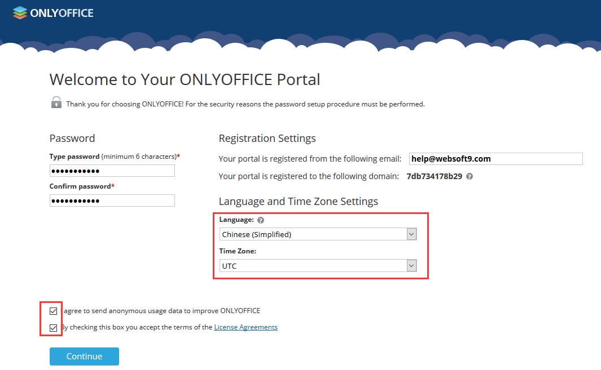
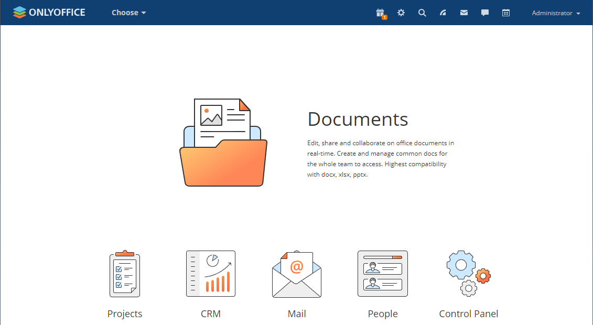
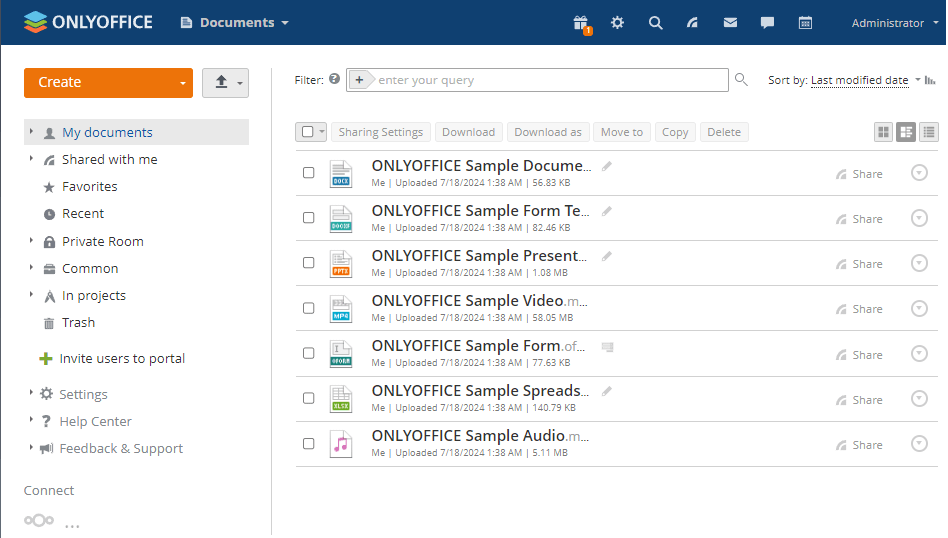
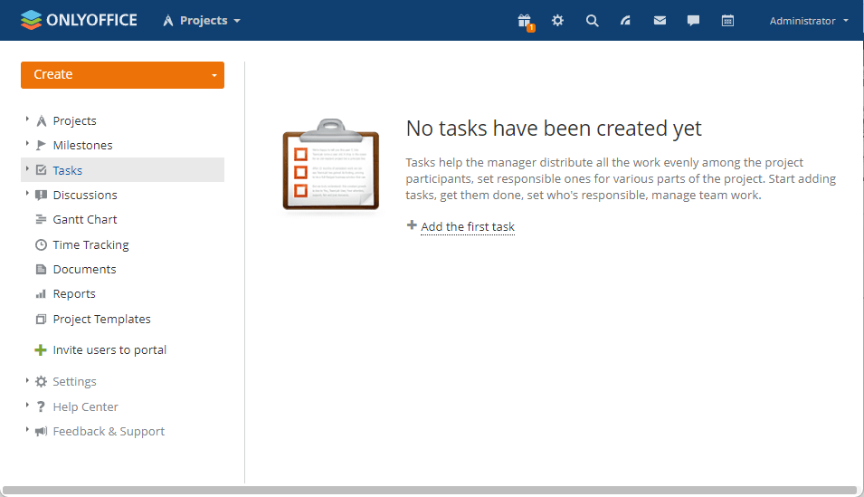
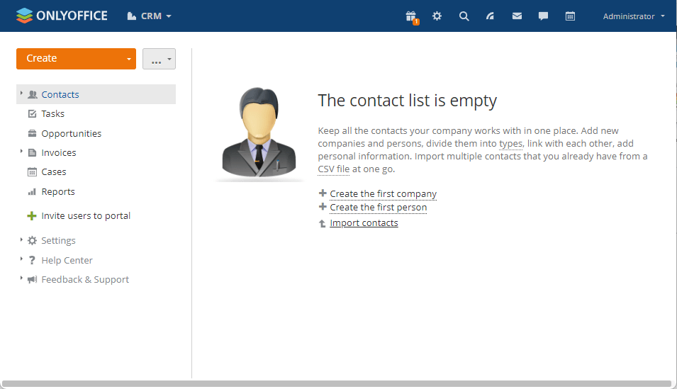
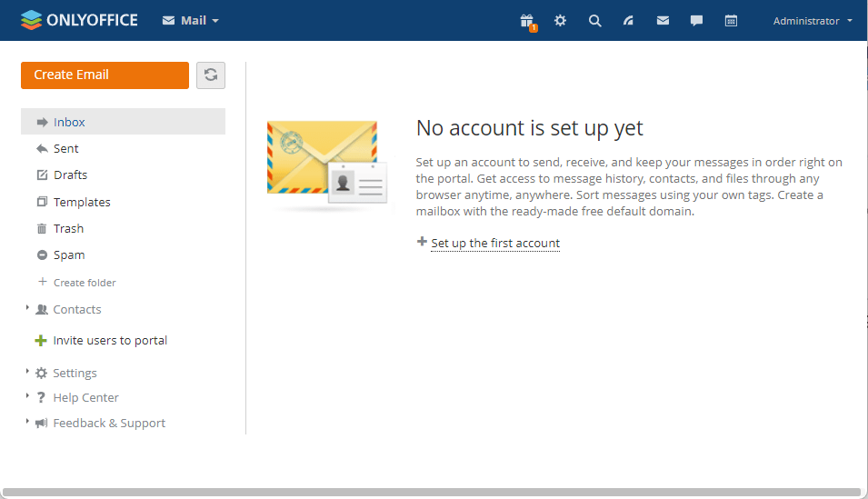
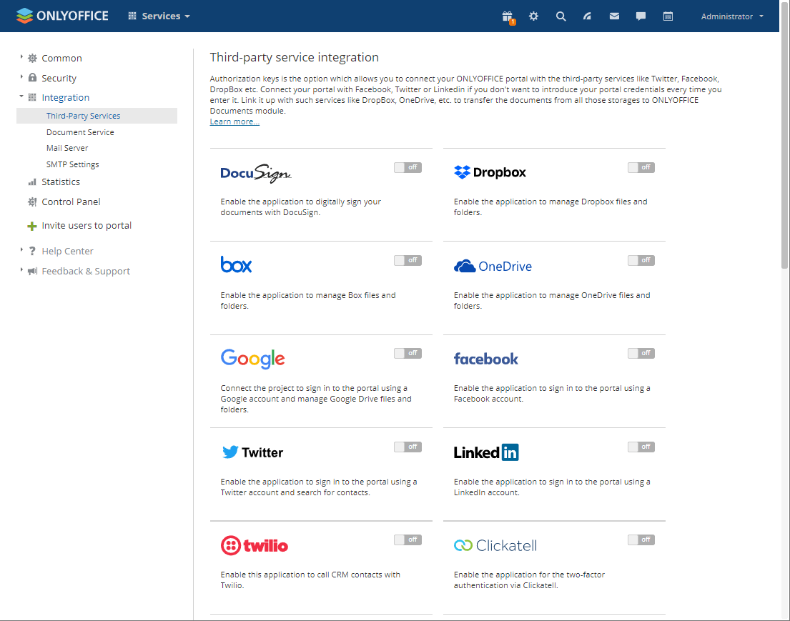

import Meta from './_include/onlyoffice.md';

<Meta name="meta" />

## Getting started{#guide}

### Initial setup{#wizard}

1. When completed installation of ONLYOFFICE Workspace at **Websoft9 Console**, get the applicaiton's **Overview** and **Access** information from **My Apps**  

2. Access the URL with local browser, enter the initialization page, and wait for 2-5 minutes until the account setup screen appears.
   

3. Set your password and email address (login name), login and start. 
   

### Demonstration of features

   * **Document management (with online editing)**
     

   * **Project Management** 
     

   * **Customer Relationship Management (CRM)** 
     

   * **Mail Management Portal** 
     

   * **Third Party Integration** 
     

## Configuration options{#configs}

- Change Password: Select **Administrator > Personal Information > Log out from all active connections**

- Multilingual (✅)
- Mail Server (Optional)
- [Compare Community Edition and Enterprise Edition](https://github.com/ONLYOFFICE/CommunityServer#compare-community-edition-and-enterprise-edition)

## Administer{#administrator}

## Troubleshooting{#troubleshooting}

