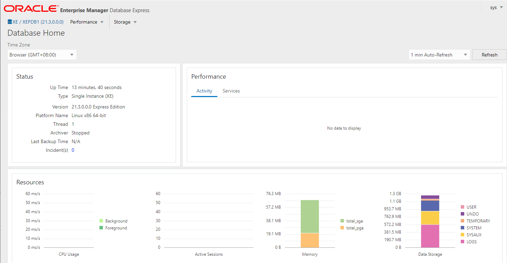

import Meta from './_include/oracle.md';

<Meta name="meta" />

## Getting started{#guide}

### Knowledge Product Disclaimer

- Oracle Database XE is free, but Enterprise and Standard Editions require a paid edition. Users need to obtain an official license
- XE installs with no server configuration limits. But has a max of 11GB storage, 1GB RAM, and 1 CPU
- Before using the software, it is recommended that you read the [OTN License Agreement for Oracle Database Express Edition 11*g* Release 2](http://www.oracle.com/technetwork/licenses/database-11g-express-license-459621.html)

### Initial setup{#wizard}

#### Pulling a Mirror (Optional)

For **Oracle Database Enterprise Edition or Standard Edition**, pull an image (10G image, 100M bandwidth recommended) before installation:

   - Register for a free user account at Oracle's [official website](https://profile.oracle.com/myprofile/account/create-account.jspx)

   - Login to the [Oracle Database Repositories](https://container-registry.oracle.com/) website and read and agree to the **Oracle Standard Terms and Restrictions**

   - At this time, you are allowed to pull mirrors from the Oracle Mirror Repository

   - Connect to the cloud server and pull the Oracle database image with authorization (modify the tag)
     ```
     docker login container-registry.oracle.com/database/enterprise
     docker pull container-registry.oracle.com/database/enterprise:tag
     ```

#### Installing the application

1. When completed installation of Oracle Database at **Websoft9 Console**, get the applicaiton's **Overview** and **Access** information from **My Apps**  

#### Oracle EM Connecting to the Database

1. Local browser `https` to access the EM login interface, enter the default username and password, then enter the Oracle EM console
   

2. Enter the Oracle database container and run the following command to test availability
   ```
   sqlplus SYS  AS SYSDBA
   ```

### Graphical management

We recommend using [CloudBeaver](./cloudbeaver) as the web-based management platform for Oracle databases:

1. Create a new Oracle database connection with key information:

   - Service Type: SID
   - Role: SYSDBA

    

2. Successful connection screen
    


### Get SID or Servce Name{#getsid}

1. Run the sqlplus command in the Oracle container
    ```
    sqlplus / as sysdba 
    ```
2. Run the SQL command to query instance information, where `instance_name` is the required information
    ```
    SQL> show parameter instance

    NAME                                 TYPE        VALUE
    ------------------------------------ ----------- ------------------------------
    active_instance_count                integer
    instance_abort_delay_time            integer     0
    instance_groups                      string
    instance_mode                        string      READ-WRITE
    instance_name                        string      XE
    instance_number                      integer     0
    instance_type                        string      RDBMS
    open_links_per_instance              integer     4
    parallel_instance_group              string
    ```

## Configuration options{#configs}

- Container Port

  | Port Number | Purpose | Necessity |
  | ------ | --------------------------------------------- | ------ |
  | 1521 | Remotely connect to Oracle Database | Optional |
  | 5500 | HTTPS access to Oracle EM | Optional |

- Oracle Database configuration file path (mounted): */opt/oracle/oradata/dbconfig*  

- Reset password command: `. /setPassword.sh <your_password>`

- Client command:

  - `sqlplus / as sysdba`
  - expdp export
  - impdp export
  - rman Backup and Restore

- Oracle Connection Information

  * User name: sys
  * Role: SYSDBA
  * Port: 1521 or other customized port
  * [Service Name or SID](#getsid)

- Eco Tools:
  
  - SQL Developer: SQL Developer is a graphical version of SQL*Plus
  - [APEX](./apex): Web application development tool for Oracle Database.
  - [Oracle REST Data Services](https://www.oracle.com/database/technologies/appdev/rest.html)
  - Oracle GoldenGate: An asynchronous, log-based, real-time data replication product
  - Oracle Clusterware is a tool that implements Oracle Real Application Clusters (Oracle RAC)  

## Administer{#administrator}

- **Backup and Recovery**: Oracle backup and recovery is primarily accomplished through Recovery Manager (RMAN) with the command `rman`


## Troubleshooting{#troubleshooting}

#### Error ORA-28040?

Description: Error “ORA-28040: No matching authentication protocol”?  
Reason: The protocol versions of the client and server do not match   
Solution: Upgrade the client

#### Error ORA-28009?

Description: ORA-28009: connection as SYS should be as SYSDBA or SYSOPER?  
Reason: The user does not match the default role when connecting to the database    
Solution: Select SYSDBA or SYSOPER for the role in the connection information

#### Error ORA-00440: Message 440...?

Description: ORA-00440: Message 440 not found;product=RDBMS;facility=ORA?     
Reason: The sys user with sysdba privileges is on the root repository and needs to connect to the Data PDB repository    

#### What is the difference between SID and Service Name?

SID is the unique name of the database instance. Service Name is an alias registered with TNS. You can configure multiple Service Names for the same database instance  

Therefore, in most cases, the SID and Service Name names are the same

#### Oracle Visual Management Tools?

* EM: Enterprise Manager, mainly for monitoring purposes
* Oracle SQL Developer: You can import/export, write SQL scripts, etc
* ORDS: Oracle Web-enabled middleware, provides API, PL/SQL and other capabilities, integrated with Oracle SQL Developer
* [APEX](./apex): a code-free development platform based on ORDS

#### What is PL/SQL?

PL/SQL is the Oracle server-side programming language for stored procedures


#### Do I have to configure Oracle Net Services?

Oracle Net Services provides enterprise-wide connectivity solutions in distributed heterogeneous computing environments.Oracle Net is a component of Oracle Net Services that supports network sessions from client applications to databases  

Therefore, it is not a required configuration in a standalone environment  

#### Where is Oracle user information stored?

It is stored in the user$ table under sys:

```
select * from sys.user$;
```
