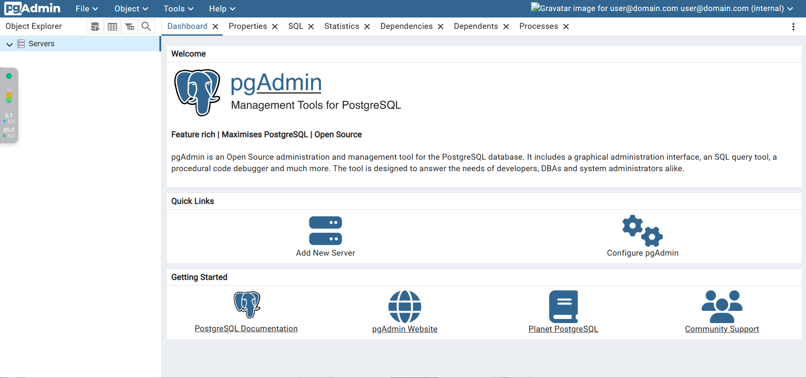

import Meta from './_include/pgadmin.md';

<Meta name="meta" />

## Getting started{#guide}

### Initial setup{#wizard}

Before using pgAdmin, if you do not have PostgreSQL, you can install it through the **App Store** in the Websoft9 console

### Login to pgAdmin to connect to the database

When completed installation of pgAdmin at **Websoft9 Console**, get the applicaiton's **Overview** and **Access** information from **My Apps**  

1. Local computer browser login page, enter pgAdmin
   

2. After logining successfully, enter the console
   

3. Connect to a PostgreSQL database
  

### Database management

- **Servers > Create > Database**, create a database
- **Servers > Create > Login/Group Role**, to create a user (a PostgreSQL user)

## Configuration options{#configs}

- pgAdmin Client: [Windows Download](https://www.pgadmin.org/download/)
- Backup(✅)

## Administer{#administrator}

## Troubleshooting{#troubleshooting}

